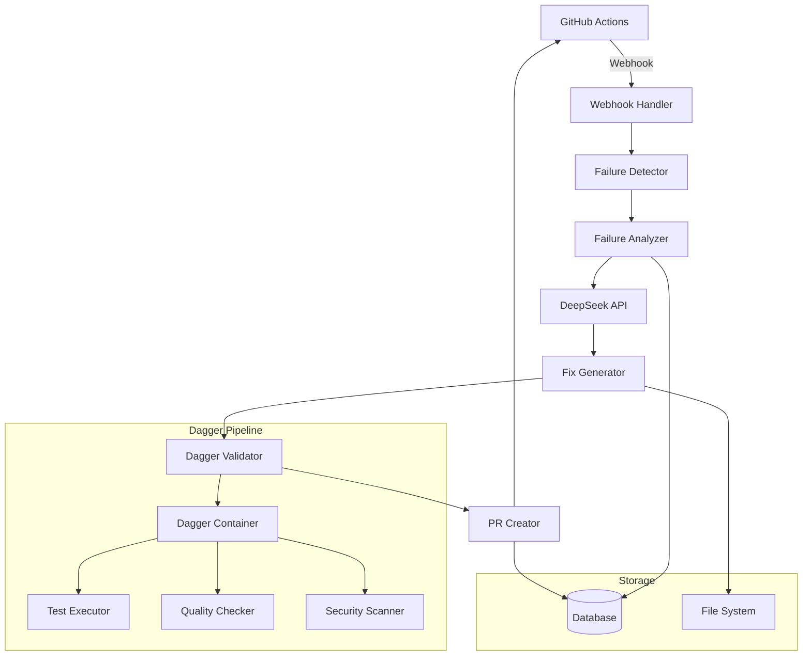

# Design Document

## Overview

The Dagger Test Repair Agent is an automated system that monitors GitHub Actions workflows, detects test failures, analyzes them using DeepSeek API, generates fixes, and creates pull requests. The system is built using Dagger.io for reproducible containerized operations and integrates seamlessly with the existing CI/CD pipeline defined in `.github/workflows/ci.yml`.

The agent operates as a GitHub App or webhook-triggered service that responds to workflow failures, processes them through AI-powered analysis, and provides automated remediation through pull requests.

## Architecture

### High-Level Architecture



### Component Architecture

The system consists of several key components:

1. **Webhook Handler**: Receives GitHub webhook events for workflow failures
2. **Failure Detector**: Parses workflow runs and identifies specific failure types
3. **Failure Analyzer**: Uses DeepSeek API to analyze failures and determine root causes
4. **Fix Generator**: Generates code fixes based on analysis results
5. **Dagger Validator**: Validates fixes using containerized test environments
6. **PR Creator**: Creates and manages pull requests with fixes
7. **Configuration Manager**: Handles agent configuration and feature flags

## Components and Interfaces

### 1. Webhook Handler

**Purpose**: Receives and processes GitHub webhook events

**Interface**:
```python
class WebhookHandler:
    async def handle_workflow_run(self, event: WorkflowRunEvent) -> None
    async def handle_check_run(self, event: CheckRunEvent) -> None
    async def validate_signature(self, payload: bytes, signature: str) -> bool
```

**Key Features**:
- Validates GitHub webhook signatures
- Filters for relevant events (workflow failures)
- Queues events for processing
- Implements rate limiting and deduplication

### 2. Failure Detector

**Purpose**: Analyzes workflow runs to identify and categorize failures

**Interface**:
```python
class FailureDetector:
    async def detect_failures(self, workflow_run: WorkflowRun) -> List[Failure]
    async def categorize_failure(self, failure: Failure) -> FailureCategory
    async def extract_logs(self, job: Job) -> str
```

**Supported Failure Types**:
- Unit test failures (pytest)
- Integration test failures
- Coverage failures (< 80%)
- Documentation validation failures
- Quality check failures (Ruff, mypy)
- Security scan failures (safety, bandit)
- Performance benchmark failures
- Import/dependency errors

### 3. Failure Analyzer

**Purpose**: Uses DeepSeek API to analyze failures and determine root causes

**Interface**:
```python
class FailureAnalyzer:
    async def analyze_failure(self, failure: Failure) -> Analysis
    async def get_code_context(self, failure: Failure) -> CodeContext
    async def generate_analysis_prompt(self, failure: Failure, context: CodeContext) -> str
```

**DeepSeek Integration**:
- Constructs detailed prompts with error context
- Includes relevant code snippets and file structure
- Sanitizes sensitive information before API calls
- Implements retry logic and rate limiting
- Caches analysis results to reduce API usage

### 4. Fix Generator

**Purpose**: Generates code fixes based on analysis results

**Interface**:
```python
class FixGenerator:
    async def generate_fix(self, analysis: Analysis) -> Fix
    async def apply_fix(self, fix: Fix) -> List[FileChange]
    async def validate_fix_syntax(self, fix: Fix) -> bool
```

**Fix Types**:
- **Syntax Fixes**: Correct Python syntax errors
- **Import Fixes**: Add missing imports, update PYTHONPATH
- **Test Fixes**: Fix assertion errors, add missing test cases
- **Coverage Fixes**: Generate additional tests to meet coverage thresholds
- **Quality Fixes**: Apply Ruff formatting, add type annotations
- **Dependency Fixes**: Update pyproject.toml, uv.lock files
- **Security Fixes**: Address security vulnerabilities

### 5. Dagger Validator

**Purpose**: Validates fixes using containerized test environments

**Interface**:
```python
class DaggerValidator:
    async def validate_fix(self, fix: Fix) -> ValidationResult
    async def run_tests(self, python_version: str, test_type: str) -> TestResult
    async def run_quality_checks(self) -> QualityResult
```

**Validation Pipeline**:
```python
@dagger.function
async def validate_python_fix(
    self,
    source: dagger.Directory,
    python_version: str,
    test_command: str
) -> dagger.Container:
    return (
        self.container()
        .from_(f"python:{python_version}")
        .with_directory("/src", source)
        .with_workdir("/src")
        .with_exec(["pip", "install", "uv"])
        .with_exec(["uv", "venv", "--python", python_version])
        .with_exec(["bash", "-c", "source .venv/bin/activate && uv pip install -e ."])
        .with_exec(["bash", "-c", f"source .venv/bin/activate && {test_command}"])
    )
```

### 6. PR Creator

**Purpose**: Creates and manages pull requests with fixes

**Interface**:
```python
class PRCreator:
    async def create_pr(self, fix: Fix, validation: ValidationResult) -> PullRequest
    async def update_pr_description(self, pr: PullRequest, details: str) -> None
    async def add_labels(self, pr: PullRequest, labels: List[str]) -> None
    async def check_existing_prs(self, fix: Fix) -> Optional[PullRequest]
```

**PR Features**:
- Descriptive titles and detailed descriptions
- Links to original failing workflow runs
- Automated labels based on fix type
- Conflict detection and resolution
- Auto-closing when issues are resolved elsewhere

## Data Models

### Core Models

```python
@dataclass
class Failure:
    id: str
    workflow_run_id: str
    job_name: str
    step_name: str
    python_version: Optional[str]
    error_message: str
    logs: str
    file_path: Optional[str]
    line_number: Optional[int]
    category: FailureCategory
    created_at: datetime

@dataclass
class Analysis:
    failure_id: str
    root_cause: str
    suggested_fix_type: str
    confidence_score: float
    code_context: CodeContext
    deepseek_response: str
    created_at: datetime

@dataclass
class Fix:
    analysis_id: str
    fix_type: str
    file_changes: List[FileChange]
    test_commands: List[str]
    description: str
    estimated_impact: str

@dataclass
class ValidationResult:
    fix_id: str
    success: bool
    test_results: Dict[str, TestResult]
    quality_results: QualityResult
    logs: str
    duration: float
```

### Configuration Models

```python
@dataclass
class AgentConfig:
    enabled_fix_types: List[str]
    python_versions: List[str]
    max_concurrent_fixes: int
    coverage_threshold: float
    file_patterns: Dict[str, List[str]]  # include/exclude patterns
    deepseek_config: DeepSeekConfig
    github_config: GitHubConfig
    dagger_config: DaggerConfig

@dataclass
class DeepSeekConfig:
    api_key: str
    model: str
    max_tokens: int
    temperature: float
    rate_limit: int
    timeout: int
```

## Error Handling

### Error Categories

1. **GitHub API Errors**: Rate limits, authentication, network issues
2. **DeepSeek API Errors**: Rate limits, invalid responses, timeouts
3. **Dagger Errors**: Container failures, build errors, timeout issues
4. **Validation Errors**: Test failures, quality check failures
5. **Git Errors**: Merge conflicts, permission issues

### Error Handling Strategy

```python
class ErrorHandler:
    async def handle_github_error(self, error: GitHubError) -> ErrorAction
    async def handle_deepseek_error(self, error: DeepSeekError) -> ErrorAction
    async def handle_dagger_error(self, error: DaggerError) -> ErrorAction
    
    async def implement_backoff(self, error_type: str, attempt: int) -> int
    async def create_fallback_issue(self, failure: Failure, error: Exception) -> None
```

**Retry Logic**:
- Exponential backoff for API rate limits
- Circuit breaker pattern for persistent failures
- Graceful degradation when services are unavailable
- Fallback to manual issue creation when automation fails

## Testing Strategy

### Unit Testing

- **Component Tests**: Test each component in isolation
- **Mock Integration**: Mock external APIs (GitHub, DeepSeek)
- **Error Simulation**: Test error handling and edge cases
- **Configuration Tests**: Validate configuration parsing and validation

### Integration Testing

- **End-to-End Workflows**: Test complete failure-to-PR workflows
- **API Integration**: Test real GitHub and DeepSeek API interactions
- **Dagger Pipeline Tests**: Validate containerized operations
- **Database Integration**: Test data persistence and retrieval

### Validation Testing

- **Fix Quality**: Validate that generated fixes actually resolve issues
- **Regression Testing**: Ensure fixes don't introduce new problems
- **Performance Testing**: Validate response times and resource usage
- **Security Testing**: Ensure no sensitive data leakage

### Test Environment Setup

```python
@pytest.fixture
async def test_environment():
    """Set up isolated test environment with mocked services"""
    async with TestEnvironment() as env:
        env.mock_github_api()
        env.mock_deepseek_api()
        env.setup_test_repository()
        yield env

@pytest.fixture
def dagger_client():
    """Provide Dagger client for integration tests"""
    return dagger.Connection()
```

## Security Considerations

### Data Protection

1. **Sensitive Data Sanitization**: Remove API keys, passwords, tokens from code sent to DeepSeek
2. **Secure Configuration**: Use environment variables and secrets management
3. **Access Control**: Implement proper GitHub App permissions
4. **Audit Logging**: Log all operations for security monitoring

### API Security

1. **Authentication**: Secure GitHub webhook signature validation
2. **Rate Limiting**: Implement proper rate limiting for all APIs
3. **Input Validation**: Validate all inputs to prevent injection attacks
4. **Output Sanitization**: Sanitize AI-generated code before applying

### Container Security

1. **Image Security**: Use minimal, security-scanned base images
2. **Isolation**: Run validation in isolated containers
3. **Resource Limits**: Implement proper resource constraints
4. **Network Security**: Restrict network access in validation containers

## Deployment Architecture

### Infrastructure Components

1. **Application Server**: Hosts the main agent application
2. **Database**: Stores failure history, analysis results, and metrics
3. **Message Queue**: Handles asynchronous processing of failures
4. **File Storage**: Temporary storage for code changes and logs
5. **Monitoring**: Observability and alerting infrastructure

### Deployment Pipeline

```yaml
# dagger-agent-deployment.yml
name: Deploy Dagger Test Repair Agent

on:
  push:
    branches: [main]
    paths: ['dagger-agent/**']

jobs:
  deploy:
    runs-on: ubuntu-latest
    steps:
      - uses: actions/checkout@v4
      - name: Deploy with Dagger
        run: |
          dagger call deploy \
            --source . \
            --environment production \
            --github-app-id ${{ secrets.GITHUB_APP_ID }} \
            --github-private-key ${{ secrets.GITHUB_PRIVATE_KEY }} \
            --deepseek-api-key ${{ secrets.DEEPSEEK_API_KEY }}
```

### Configuration Management

- **Environment Variables**: For runtime configuration
- **Config Files**: For complex configuration structures
- **Secrets Management**: For sensitive credentials
- **Feature Flags**: For gradual rollout of new features

## Performance Considerations

### Optimization Strategies

1. **Caching**: Cache DeepSeek API responses and analysis results
2. **Parallel Processing**: Process multiple failures concurrently
3. **Resource Pooling**: Reuse Dagger containers when possible
4. **Batch Operations**: Group similar operations together

### Monitoring and Metrics

- **Response Times**: Track end-to-end processing times
- **Success Rates**: Monitor fix success rates by category
- **API Usage**: Track DeepSeek API token consumption
- **Resource Usage**: Monitor CPU, memory, and storage usage
- **Error Rates**: Track error rates and types

### Scalability

- **Horizontal Scaling**: Scale agent instances based on load
- **Queue Management**: Use message queues for load balancing
- **Database Optimization**: Optimize queries and indexing
- **Container Orchestration**: Use Kubernetes for container management