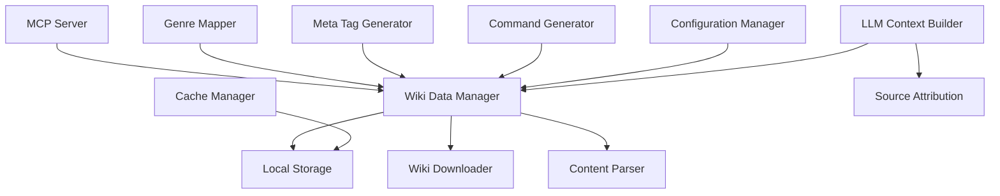

# Design Document

## Overview

The Dynamic Suno Data Integration system will enhance the Character Music MCP by replacing static hardcoded mappings with dynamic data sourced from the Suno AI Wiki. The system will download, cache, and parse wiki pages locally to provide comprehensive genre information, meta tags, and advanced techniques for music generation.

## Architecture

### High-Level Architecture



### Component Interaction Flow

1. **Initialization**: Wiki Data Manager loads configuration and checks local storage
2. **Data Refresh**: Downloader fetches fresh content based on configured intervals
3. **Parsing**: Content Parser extracts structured data from HTML pages
4. **Generation**: Music generation components query parsed data instead of hardcoded mappings
5. **Context Building**: LLM context includes relevant wiki content with source URLs

## Components and Interfaces

### WikiDataManager

**Purpose**: Central coordinator for all wiki data operations

**Interface**:
```python
class WikiDataManager:
    async def initialize(self, config: WikiConfig) -> None
    async def get_genres(self) -> List[Genre]
    async def get_meta_tags(self, category: str = None) -> List[MetaTag]
    async def get_techniques(self, technique_type: str) -> List[Technique]
    async def refresh_data(self, force: bool = False) -> RefreshResult
    def get_source_urls(self, data_type: str) -> List[str]
```

### WikiDownloader

**Purpose**: Downloads and manages wiki page content

**Interface**:
```python
class WikiDownloader:
    async def download_page(self, url: str, local_path: str) -> DownloadResult
    async def download_all_configured_pages(self) -> List[DownloadResult]
    def is_refresh_needed(self, local_path: str, max_age_hours: int) -> bool
    async def validate_url(self, url: str) -> bool
```

### ContentParser

**Purpose**: Extracts structured data from downloaded HTML pages

**Interface**:
```python
class ContentParser:
    def parse_genre_page(self, html_content: str) -> List[Genre]
    def parse_meta_tag_page(self, html_content: str) -> List[MetaTag]
    def parse_tip_page(self, html_content: str) -> List[Technique]
    def extract_structured_content(self, html: str, page_type: str) -> ParsedContent
```

### EnhancedGenreMapper

**Purpose**: Maps character traits to wiki-sourced genres

**Interface**:
```python
class EnhancedGenreMapper:
    async def map_traits_to_genres(self, traits: List[str]) -> List[GenreMatch]
    def calculate_genre_confidence(self, trait: str, genre: Genre) -> float
    def get_genre_hierarchy(self, genre: str) -> GenreHierarchy
    async def find_similar_genres(self, target_genre: str) -> List[Genre]
```

### SourceAttributionManager

**Purpose**: Manages source URL attribution for LLM context

**Interface**:
```python
class SourceAttributionManager:
    def build_attributed_context(self, content: Any, sources: List[str]) -> AttributedContent
    def format_source_references(self, sources: List[str]) -> str
    def track_content_usage(self, content_id: str, source_url: str) -> None
```

## Data Models

### Genre Model
```python
@dataclass
class Genre:
    name: str
    description: str
    subgenres: List[str]
    characteristics: List[str]
    typical_instruments: List[str]
    mood_associations: List[str]
    source_url: str
    download_date: datetime
    confidence_score: float = 1.0
```

### MetaTag Model
```python
@dataclass
class MetaTag:
    tag: str
    category: str  # structural, emotional, instrumental, vocal, etc.
    description: str
    usage_examples: List[str]
    compatible_genres: List[str]
    source_url: str
    download_date: datetime
```

### Technique Model
```python
@dataclass
class Technique:
    name: str
    description: str
    technique_type: str  # prompt_structure, vocal_style, production, etc.
    examples: List[str]
    applicable_scenarios: List[str]
    source_url: str
    download_date: datetime
```

### WikiConfig Model
```python
@dataclass
class WikiConfig:
    enabled: bool = True
    local_storage_path: str = "./data/wiki"
    refresh_interval_hours: int = 24
    fallback_to_hardcoded: bool = True
    
    genre_pages: List[str] = field(default_factory=lambda: [
        "https://sunoaiwiki.com/resources/2024-05-03-list-of-music-genres-and-styles/"
    ])
    
    meta_tag_pages: List[str] = field(default_factory=lambda: [
        "https://sunoaiwiki.com/resources/2024-05-13-list-of-metatags/"
    ])
    
    tip_pages: List[str] = field(default_factory=lambda: [
        "https://sunoaiwiki.com/tips/2024-05-02-how-to-enhance-song-production-using-suno-ai/",
        "https://sunoaiwiki.com/tips/2024-04-16-how-to-make-suno-ai-sing-with-spoken-word/",
        "https://sunoaiwiki.com/tips/2024-05-04-how-to-structure-prompts-for-suno-ai/",
        "https://sunoaiwiki.com/tips/2024-05-04-how-to-use-meta-tags-in-suno-ai-for-song-creation/",
        "https://sunoaiwiki.com/tips/2024-05-07-how-to-get-specific-vocal-styles-in-suno-ai/",
        "https://sunoaiwiki.com/tips/2024-05-08-how-to-bypass-explicit-lyric-restrictions/",
        "https://sunoaiwiki.com/tips/2024-05-09-how-to-end-a-song-naturally/",
        "https://sunoaiwiki.com/tips/2024-05-18-how-to-optimize-prompts-in-suno-ai-with-letter-case/",
        "https://sunoaiwiki.com/tips/2024-05-22-how-to-prompt-suno-ai-to-use-animal-sounds-and-noises/",
        "https://sunoaiwiki.com/tips/2024-05-22-how-to-solve-suno-ai-sampling-detection-issues/",
        "https://sunoaiwiki.com/tips/2024-05-25-how-to-handle-producer-tags-in-suno-ai/",
        "https://sunoaiwiki.com/tips/2024-07-08-how-to-create-better-lyrics-for-suno/",
        "https://sunoaiwiki.com/tips/2024-07-08-improve-suno-hiphop-rap-trap/"
    ])
```

## Error Handling

### Graceful Degradation Strategy

1. **Network Failures**: Use cached local files if available
2. **Parse Failures**: Fall back to hardcoded data with logging
3. **Missing Files**: Attempt re-download, then use hardcoded fallbacks
4. **Invalid URLs**: Log error and skip problematic URLs
5. **Partial Data**: Use available data and supplement with hardcoded mappings

### Error Recovery Mechanisms

```python
class ErrorRecoveryManager:
    async def handle_download_failure(self, url: str, error: Exception) -> RecoveryAction
    async def handle_parse_failure(self, content: str, error: Exception) -> RecoveryAction
    def get_fallback_data(self, data_type: str) -> Any
    async def schedule_retry(self, operation: str, delay_minutes: int) -> None
```

## Testing Strategy

### Unit Testing
- **WikiDownloader**: Mock HTTP requests, test error handling
- **ContentParser**: Test with sample HTML files, edge cases
- **GenreMapper**: Test trait-to-genre matching algorithms
- **SourceAttributionManager**: Test context building and attribution

### Integration Testing
- **End-to-End Data Flow**: Download → Parse → Generate → Attribute
- **Fallback Scenarios**: Test behavior when wiki is unavailable
- **Configuration Changes**: Test dynamic reconfiguration
- **Cache Management**: Test refresh cycles and storage limits

### Performance Testing
- **Large Dataset Handling**: Test with full wiki content
- **Concurrent Access**: Multiple generation requests simultaneously
- **Memory Usage**: Monitor memory consumption with cached data
- **Response Times**: Ensure acceptable latency for music generation

### Validation Testing
- **Data Quality**: Verify parsed data accuracy against source
- **Source Attribution**: Ensure all content properly attributed
- **Configuration Validation**: Test invalid configurations
- **URL Validation**: Test malformed and unreachable URLs

## Implementation Phases

### Phase 1: Core Infrastructure
1. Implement WikiDataManager and basic configuration
2. Create WikiDownloader with error handling
3. Implement local file storage and caching
4. Add basic ContentParser for HTML processing

### Phase 2: Data Integration
1. Implement genre page parsing and integration
2. Add meta tag page parsing and categorization
3. Create enhanced genre mapping with wiki data
4. Implement fallback mechanisms

### Phase 3: Advanced Features
1. Add tip page parsing and technique extraction
2. Implement source attribution system
3. Create LLM context building with URLs
4. Add intelligent genre matching algorithms

### Phase 4: Optimization and Polish
1. Performance optimization and caching improvements
2. Comprehensive error handling and recovery
3. Configuration management and validation
4. Documentation and developer guides