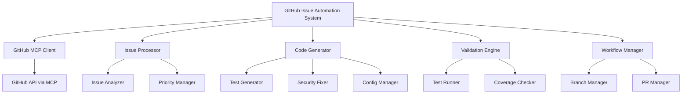

# Design Document

## Overview

The GitHub Issue Automation System is a comprehensive solution that automatically processes open GitHub issues by creating branches, implementing code fixes, and submitting pull requests. The system leverages the GitHub MCP server for secure repository operations and implements intelligent issue analysis to provide real solutions to identified problems.

The system is designed to handle the 10 open issues in the character-music-mcp repository, with special focus on critical issues like security vulnerabilities, test infrastructure problems, and test coverage improvements. It follows a structured workflow that ensures code quality and maintains repository integrity.

## Architecture

### High-Level Architecture



### System Flow

1. **Authentication & Setup**: Authenticate with GitHub MCP server and validate repository access
2. **Issue Discovery**: Fetch and categorize open issues by priority and type
3. **Processing Pipeline**: For each issue, create branch → analyze requirements → implement fixes → validate → commit → create PR
4. **Monitoring & Reporting**: Track progress and provide comprehensive results

## Components and Interfaces

### 1. GitHub MCP Client (`GitHubMCPClient`)

**Purpose**: Handles all GitHub operations through the MCP server

**Key Methods**:
- `authenticate()`: Verify MCP server connection and permissions
- `list_issues(repo_owner, repo_name)`: Fetch open issues
- `create_branch(repo_owner, repo_name, branch_name, from_branch)`: Create issue branch
- `push_files(repo_owner, repo_name, branch, files, message)`: Push code changes
- `create_pull_request(repo_owner, repo_name, head, base, title, body)`: Create PR

**Interface**:
```python
class GitHubMCPClient:
    async def authenticate(self) -> bool
    async def list_issues(self, owner: str, repo: str) -> List[GitHubIssue]
    async def create_branch(self, owner: str, repo: str, branch: str, from_branch: str) -> bool
    async def push_files(self, owner: str, repo: str, branch: str, files: List[FileChange], message: str) -> bool
    async def create_pull_request(self, owner: str, repo: str, head: str, base: str, title: str, body: str) -> str
```

### 2. Issue Processor (`IssueProcessor`)

**Purpose**: Analyzes and categorizes issues for processing

**Key Methods**:
- `analyze_issue(issue)`: Extract requirements and determine fix strategy
- `prioritize_issues(issues)`: Sort issues by severity and impact
- `determine_fix_strategy(issue)`: Choose appropriate resolution approach

**Interface**:
```python
class IssueProcessor:
    def analyze_issue(self, issue: GitHubIssue) -> IssueAnalysis
    def prioritize_issues(self, issues: List[GitHubIssue]) -> List[GitHubIssue]
    def determine_fix_strategy(self, issue: GitHubIssue) -> FixStrategy
```

### 3. Code Generator (`CodeGenerator`)

**Purpose**: Implements actual code fixes for different issue types

**Key Methods**:
- `fix_security_vulnerabilities(issue)`: Replace MD5 with SHA-256, fix security issues
- `fix_test_collection_issues(issue)`: Rename test classes, fix pytest warnings
- `improve_test_coverage(issue)`: Add tests for 0% coverage files
- `fix_async_test_issues(issue)`: Fix pytest-asyncio configuration
- `standardize_mcp_config(issue)`: Update MCP configuration format

**Interface**:
```python
class CodeGenerator:
    async def fix_security_vulnerabilities(self, issue: GitHubIssue) -> List[FileChange]
    async def fix_test_collection_issues(self, issue: GitHubIssue) -> List[FileChange]
    async def improve_test_coverage(self, issue: GitHubIssue) -> List[FileChange]
    async def fix_async_test_issues(self, issue: GitHubIssue) -> List[FileChange]
    async def standardize_mcp_config(self, issue: GitHubIssue) -> List[FileChange]
```

### 4. Validation Engine (`ValidationEngine`)

**Purpose**: Validates code changes before committing

**Key Methods**:
- `run_tests()`: Execute test suite to verify changes
- `check_coverage()`: Measure test coverage improvements
- `validate_syntax()`: Check code syntax and imports
- `security_scan()`: Verify security improvements

**Interface**:
```python
class ValidationEngine:
    async def run_tests(self, files: List[str]) -> TestResults
    async def check_coverage(self) -> CoverageReport
    async def validate_syntax(self, files: List[FileChange]) -> ValidationResults
    async def security_scan(self, files: List[str]) -> SecurityReport
```

### 5. Workflow Manager (`WorkflowManager`)

**Purpose**: Orchestrates the entire issue resolution process

**Key Methods**:
- `process_all_issues()`: Main entry point for processing all issues
- `process_single_issue(issue)`: Handle individual issue resolution
- `generate_todo_list(issues)`: Create structured task list
- `generate_summary(results)`: Create final processing report

**Interface**:
```python
class WorkflowManager:
    async def process_all_issues(self, repo_owner: str, repo_name: str) -> ProcessingResults
    async def process_single_issue(self, issue: GitHubIssue) -> IssueResult
    def generate_todo_list(self, issues: List[GitHubIssue]) -> TodoList
    def generate_summary(self, results: List[IssueResult]) -> ProcessingSummary
```

## Data Models

### Core Data Structures

```python
@dataclass
class GitHubIssue:
    number: int
    title: str
    body: str
    labels: List[str]
    state: str
    priority: IssuePriority
    issue_type: IssueType

@dataclass
class FileChange:
    path: str
    content: str
    operation: str  # 'create', 'update', 'delete'

@dataclass
class IssueResult:
    issue_number: int
    branch_name: str
    pr_url: Optional[str]
    status: ProcessingStatus
    resolution_summary: str
    files_changed: List[str]
    error_message: Optional[str]

@dataclass
class ProcessingResults:
    total_issues: int
    processed_successfully: int
    failed_issues: int
    results: List[IssueResult]
    todo_list: Optional[TodoList]
    summary: ProcessingSummary
```

### Issue Classification

```python
class IssueType(Enum):
    SECURITY_VULNERABILITY = "security"
    TEST_INFRASTRUCTURE = "test_infrastructure"
    TEST_COVERAGE = "test_coverage"
    CONFIGURATION = "configuration"
    DOCUMENTATION = "documentation"
    ENHANCEMENT = "enhancement"
    BUG_FIX = "bug"

class IssuePriority(Enum):
    CRITICAL = 1
    HIGH = 2
    MEDIUM = 3
    LOW = 4
```

## Error Handling

### Retry Strategy

- **MCP Server Requests**: 3 retries with exponential backoff (1s, 2s, 4s)
- **GitHub API Rate Limits**: Respect rate limit headers and wait appropriately
- **Network Errors**: 5 retries with exponential backoff (2s, 4s, 8s, 16s, 32s)
- **Test Execution**: 2 retries for flaky tests

### Error Recovery

1. **Individual Issue Failures**: Continue processing other issues
2. **Authentication Failures**: Stop execution with clear error message
3. **Repository Access Issues**: Validate permissions and provide guidance
4. **Code Generation Failures**: Log error and skip to next issue
5. **Validation Failures**: Attempt to fix common issues automatically

### Error Logging

```python
class ErrorHandler:
    def log_error(self, operation: str, issue_number: int, error: Exception)
    def log_retry(self, operation: str, attempt: int, max_attempts: int)
    def log_skip(self, issue_number: int, reason: str)
    def generate_error_report(self) -> ErrorReport
```

## Testing Strategy

### Unit Testing

- **Component Testing**: Test each component in isolation with mocked dependencies
- **MCP Client Testing**: Mock MCP server responses for GitHub operations
- **Code Generator Testing**: Verify generated code fixes for each issue type
- **Validation Engine Testing**: Test validation logic with sample code changes

### Integration Testing

- **End-to-End Workflow**: Test complete issue processing pipeline
- **GitHub MCP Integration**: Test actual MCP server communication (with test repository)
- **File System Operations**: Test file creation, modification, and validation
- **Error Handling**: Test retry logic and error recovery scenarios

### Test Coverage Goals

- **Unit Tests**: 90%+ coverage for all components
- **Integration Tests**: Cover all major workflow paths
- **Error Scenarios**: Test all error handling and retry logic
- **Performance Tests**: Ensure processing completes within reasonable time limits

### Test Structure

```
tests/
├── unit/
│   ├── test_github_mcp_client.py
│   ├── test_issue_processor.py
│   ├── test_code_generator.py
│   ├── test_validation_engine.py
│   └── test_workflow_manager.py
├── integration/
│   ├── test_end_to_end_workflow.py
│   ├── test_mcp_integration.py
│   └── test_error_handling.py
└── fixtures/
    ├── sample_issues.json
    ├── mock_responses.py
    └── test_repositories/
```

## Implementation Priorities

### Phase 1: Core Infrastructure (High Priority)
1. **GitHub MCP Client**: Implement secure MCP server communication
2. **Issue Processor**: Build issue analysis and prioritization logic
3. **Basic Workflow**: Create simple issue → branch → PR workflow

### Phase 2: Code Generation (Critical)
1. **Security Fixes**: Implement MD5 → SHA-256 replacements
2. **Test Infrastructure**: Fix pytest collection warnings and async issues
3. **Test Coverage**: Add comprehensive tests for 0% coverage files

### Phase 3: Advanced Features (Medium Priority)
1. **Validation Engine**: Implement test running and coverage checking
2. **Error Handling**: Add comprehensive retry and recovery logic
3. **Reporting**: Create detailed processing summaries and todo lists

### Phase 4: Optimization (Low Priority)
1. **Performance**: Optimize for large numbers of issues
2. **Monitoring**: Add detailed logging and metrics
3. **Configuration**: Make system highly configurable

## Security Considerations

### MCP Server Security
- **Limited Scope**: Restrict MCP server access to specific repository operations
- **Authentication**: Verify MCP server credentials and permissions
- **Rate Limiting**: Respect GitHub API rate limits to avoid account restrictions

### Code Security
- **Input Validation**: Sanitize all issue content and user inputs
- **File Operations**: Validate file paths to prevent directory traversal
- **Code Generation**: Ensure generated code follows security best practices

### Repository Security
- **Branch Protection**: Work within repository branch protection rules
- **Review Requirements**: Ensure PRs are marked for review when required
- **Audit Trail**: Maintain complete logs of all operations performed

## Performance Considerations

### Scalability
- **Concurrent Processing**: Process multiple issues in parallel where safe
- **Memory Management**: Stream large files and clean up resources
- **Caching**: Cache issue analysis and code generation results

### Optimization Targets
- **Issue Processing**: < 2 minutes per issue on average
- **Test Execution**: < 5 minutes for full test suite validation
- **Memory Usage**: < 500MB peak memory consumption
- **Network Efficiency**: Minimize API calls through batching and caching

## Monitoring and Observability

### Logging Strategy
- **Structured Logging**: Use JSON format for easy parsing
- **Log Levels**: DEBUG for development, INFO for operations, ERROR for failures
- **Context**: Include issue numbers, operation types, and timestamps

### Metrics Collection
- **Processing Metrics**: Issues processed, success rate, processing time
- **Error Metrics**: Error types, retry counts, failure reasons
- **Performance Metrics**: Memory usage, API call counts, test execution time

### Alerting
- **Critical Failures**: Authentication failures, repository access issues
- **Performance Degradation**: Processing time exceeding thresholds
- **Error Rate**: High failure rates indicating systemic issues