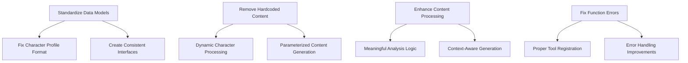

# Design Document

## Overview

The MCP Tools Diagnostic Fixes system will systematically address the critical issues identified in the diagnostic report. The main problems are format mismatches in character profiles, hardcoded content overriding user input, generic output that doesn't process input meaningfully, and function errors preventing tool execution.

## Architecture

### Current Issues Analysis

Based on the diagnostic report and code analysis, the issues fall into these categories:

1. **Format Mismatches**: Tools expect different CharacterProfile formats
2. **Hardcoded Content**: Bristol backstory and Marcus character hardcoded in WorkingUniversalProcessor
3. **Generic Processing**: Tools repeat input instead of meaningful analysis
4. **Function Errors**: 'FunctionTool' object not callable errors
5. **Character Detection Failures**: Tools fail to extract characters from clear descriptions

### High-Level Fix Strategy



## Components and Interfaces

### 1. Standardized CharacterProfile Model

**Current Issue**: Multiple tools expect different character profile formats, causing initialization errors.

**Solution**: Create a single, consistent CharacterProfile model that all tools use.

```python
@dataclass
class StandardCharacterProfile:
    """Standardized character profile for all MCP tools"""
    name: str
    aliases: List[str] = field(default_factory=list)
    
    # Physical characteristics (skin layer)
    physical_description: str = ""
    mannerisms: List[str] = field(default_factory=list)
    speech_patterns: List[str] = field(default_factory=list)
    behavioral_traits: List[str] = field(default_factory=list)
    
    # Background (flesh layer)
    backstory: str = ""
    relationships: List[str] = field(default_factory=list)
    formative_experiences: List[str] = field(default_factory=list)
    social_connections: List[str] = field(default_factory=list)
    
    # Psychology (core layer)
    motivations: List[str] = field(default_factory=list)
    fears: List[str] = field(default_factory=list)
    desires: List[str] = field(default_factory=list)
    conflicts: List[str] = field(default_factory=list)
    personality_drivers: List[str] = field(default_factory=list)
    
    # Metadata
    confidence_score: float = 1.0
    text_references: List[str] = field(default_factory=list)
    first_appearance: str = ""
    importance_score: float = 1.0
    
    @classmethod
    def from_dict(cls, data: Dict[str, Any]) -> 'StandardCharacterProfile':
        """Create from dictionary, handling missing fields gracefully"""
        return cls(**{k: v for k, v in data.items() if k in cls.__dataclass_fields__})
    
    def to_dict(self) -> Dict[str, Any]:
        """Convert to dictionary for JSON serialization"""
        return asdict(self)
```

### 2. Enhanced Character Analysis Engine

**Current Issue**: analyze_character_text returns empty characters and incorrect analysis.

**Solution**: Implement robust character detection and three-layer analysis.

```python
class EnhancedCharacterAnalyzer:
    """Improved character analysis with proper detection and layered analysis"""
    
    def analyze_text(self, text: str) -> Dict[str, Any]:
        """Perform comprehensive character analysis"""
        characters = self._detect_characters(text)
        themes = self._analyze_narrative_themes(text)
        emotional_arc = self._analyze_emotional_arc(text)
        
        return {
            "characters": [char.to_dict() for char in characters],
            "narrative_themes": themes,
            "emotional_arc": emotional_arc,
            "analysis_metadata": {
                "text_length": len(text),
                "character_count": len(characters),
                "confidence": self._calculate_overall_confidence(characters)
            }
        }
    
    def _detect_characters(self, text: str) -> List[StandardCharacterProfile]:
        """Detect and extract characters with three-layer analysis"""
        # Implementation for proper character detection
        pass
    
    def _analyze_narrative_themes(self, text: str) -> List[str]:
        """Extract meaningful narrative themes beyond just 'friendship'"""
        # Implementation for theme analysis
        pass
    
    def _analyze_emotional_arc(self, text: str) -> Dict[str, str]:
        """Analyze emotional progression through text sections"""
        # Implementation for emotional arc analysis
        pass
```

### 3. Dynamic Content Processor

**Current Issue**: WorkingUniversalProcessor has hardcoded Bristol backstory and Marcus character.

**Solution**: Create parameterized processor that uses provided character descriptions.

```python
class DynamicContentProcessor:
    """Content processor that uses provided parameters instead of hardcoded values"""
    
    def __init__(self):
        self.wiki_data_manager = None
        if WIKI_INTEGRATION_AVAILABLE:
            self.wiki_data_manager = WikiDataManager()
    
    def process_character_content(
        self, 
        character_description: str, 
        genre: str = None,
        location: str = None
    ) -> Dict[str, Any]:
        """Process content using provided character description"""
        
        # Extract character details from description
        character_details = self._parse_character_description(character_description)
        
        # Use extracted details, not hardcoded values
        return {
            "character": character_details,
            "genre": genre or self._infer_genre(character_description),
            "location": location or self._infer_location(character_description),
            "backstory": self._generate_dynamic_backstory(character_details),
            "context": self._build_dynamic_context(character_details, genre)
        }
    
    def _parse_character_description(self, description: str) -> Dict[str, Any]:
        """Extract character details from description text"""
        # Remove hardcoded Marcus/Bristol references
        # Parse actual character information from input
        pass
    
    def _generate_dynamic_backstory(self, character_details: Dict) -> str:
        """Generate backstory based on character details, not hardcoded Bristol story"""
        # Dynamic backstory generation
        pass
```

### 4. Meaningful Creative Generation Engine

**Current Issue**: creative_music_generation just repeats input without creative processing.

**Solution**: Implement actual creative analysis and variation generation.

```python
class CreativeMusicEngine:
    """Engine for meaningful creative music generation"""
    
    def generate_creative_variations(
        self, 
        concept: str, 
        style_preference: str = "any"
    ) -> Dict[str, Any]:
        """Generate meaningful creative variations, not just input repetition"""
        
        # Analyze the concept for musical elements
        musical_elements = self._analyze_musical_concept(concept)
        
        # Generate creative variations
        variations = self._create_variations(musical_elements, style_preference)
        
        # Create practical Suno commands
        suno_commands = self._generate_practical_commands(variations)
        
        return {
            "concept_analysis": musical_elements,
            "creative_variations": variations,
            "production_commands": suno_commands,
            "style_adaptations": self._adapt_to_style(variations, style_preference)
        }
    
    def _analyze_musical_concept(self, concept: str) -> Dict[str, Any]:
        """Analyze concept for musical elements instead of just repeating text"""
        # Actual musical analysis logic
        pass
    
    def _generate_practical_commands(self, variations: List[Dict]) -> List[str]:
        """Generate practical Suno AI commands that actually work"""
        # Create usable Suno commands
        pass
```

### 5. Fixed Function Tool Registration

**Current Issue**: 'FunctionTool' object not callable errors in complete_workflow.

**Solution**: Proper tool registration and callable function handling.

```python
class FixedWorkflowManager:
    """Workflow manager with proper function tool handling"""
    
    def __init__(self):
        self.tools = {
            'analyze_character_text': self._make_callable(analyze_character_text),
            'generate_artist_personas': self._make_callable(generate_artist_personas),
            'create_suno_commands': self._make_callable(create_suno_commands)
        }
    
    def _make_callable(self, tool_func):
        """Ensure tool functions are properly callable"""
        if hasattr(tool_func, '__call__'):
            return tool_func
        else:
            # Handle FunctionTool objects properly
            return lambda *args, **kwargs: tool_func(*args, **kwargs)
    
    async def execute_complete_workflow(self, text: str, ctx: Context) -> Dict[str, Any]:
        """Execute workflow with properly callable tools"""
        try:
            # Step 1: Character analysis
            analysis_result = await self.tools['analyze_character_text'](text, ctx)
            
            # Step 2: Persona generation
            personas_result = await self.tools['generate_artist_personas'](analysis_result, ctx)
            
            # Step 3: Command generation
            commands_result = await self.tools['create_suno_commands'](personas_result, analysis_result, ctx)
            
            return {
                "analysis": analysis_result,
                "personas": personas_result,
                "commands": commands_result,
                "workflow_status": "completed"
            }
        except Exception as e:
            logger.error(f"Workflow execution failed: {e}")
            raise
```

## Error Handling

### Comprehensive Error Recovery

```python
class ToolErrorHandler:
    """Centralized error handling for all MCP tools"""
    
    def handle_format_error(self, error: Exception, expected_format: str) -> Dict[str, Any]:
        """Handle format mismatch errors with helpful messages"""
        return {
            "error": "format_mismatch",
            "message": f"Expected format: {expected_format}",
            "details": str(error),
            "suggestion": "Check input data structure"
        }
    
    def handle_character_detection_error(self, text: str) -> Dict[str, Any]:
        """Handle character detection failures"""
        return {
            "error": "character_detection_failed",
            "message": "No characters found in provided text",
            "text_sample": text[:200] + "..." if len(text) > 200 else text,
            "suggestion": "Ensure text contains clear character descriptions"
        }
    
    def handle_function_callable_error(self, tool_name: str) -> Dict[str, Any]:
        """Handle FunctionTool callable errors"""
        return {
            "error": "function_not_callable",
            "tool": tool_name,
            "message": "Tool function is not properly callable",
            "suggestion": "Check tool registration and function definition"
        }
```

## Testing Strategy

### Unit Testing for Each Fixed Tool

```python
class TestFixedMCPTools:
    """Comprehensive tests for fixed MCP tools"""
    
    def test_character_profile_format_consistency(self):
        """Test that all tools use consistent character profile format"""
        # Test character profile creation and usage across tools
        pass
    
    def test_dynamic_content_processing(self):
        """Test that hardcoded content is replaced with dynamic processing"""
        # Test with different character descriptions
        # Verify no Bristol/Marcus hardcoded content appears
        pass
    
    def test_meaningful_creative_generation(self):
        """Test that creative tools generate meaningful output"""
        # Test with various concepts
        # Verify output is not just input repetition
        pass
    
    def test_character_detection_accuracy(self):
        """Test character detection with various text inputs"""
        # Test with clear character descriptions
        # Verify proper character extraction
        pass
    
    def test_function_tool_callability(self):
        """Test that all tools are properly callable"""
        # Test workflow execution
        # Verify no callable errors
        pass
```

### Integration Testing

```python
class TestMCPToolsIntegration:
    """Integration tests for fixed MCP tools"""
    
    def test_end_to_end_workflow(self):
        """Test complete workflow from analysis to command generation"""
        # Test with various character descriptions and genres
        # Verify consistent data flow between tools
        pass
    
    def test_error_recovery(self):
        """Test error handling and recovery mechanisms"""
        # Test with invalid inputs
        # Verify helpful error messages
        pass
```

## Implementation Phases

### Phase 1: Data Model Standardization
1. Create StandardCharacterProfile model
2. Update all tools to use consistent format
3. Add format validation and conversion utilities
4. Test character profile consistency across tools

### Phase 2: Remove Hardcoded Content
1. Identify all hardcoded Bristol/Marcus references
2. Replace with dynamic parameter-based processing
3. Update WorkingUniversalProcessor to use provided descriptions
4. Test with various character descriptions and genres

### Phase 3: Enhance Content Processing
1. Implement meaningful character analysis logic
2. Create actual creative generation algorithms
3. Add proper emotional analysis and theme detection
4. Test output quality and variety

### Phase 4: Fix Function Errors
1. Fix FunctionTool callable issues in complete_workflow
2. Improve tool registration and error handling
3. Add comprehensive logging and debugging
4. Test workflow execution reliability

### Phase 5: Validation and Polish
1. Comprehensive testing of all fixed tools
2. Performance optimization
3. Documentation updates
4. Final integration testing