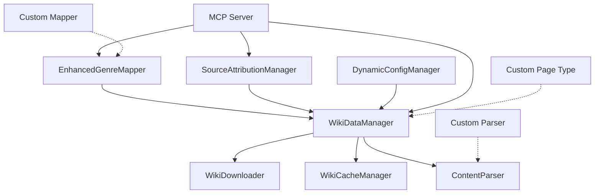

# Developer Integration Guide

## Overview

This guide provides comprehensive documentation for developers who want to extend the Wiki Data Integration system with new page types, custom parsers, and enhanced mappers. It covers all public interfaces, extension points, and provides practical examples.

## Table of Contents

1. [System Architecture](#system-architecture)
2. [Core APIs](#core-apis)
3. [Extending the System](#extending-the-system)
4. [Custom Parsers](#custom-parsers)
5. [Custom Mappers](#custom-mappers)
6. [Integration Patterns](#integration-patterns)
7. [Testing Extensions](#testing-extensions)
8. [Best Practices](#best-practices)

## System Architecture

### Component Overview



### Extension Points

The system provides several extension points:

1. **Custom Page Types**: Add new wiki page categories
2. **Custom Parsers**: Parse new HTML structures
3. **Custom Mappers**: Create specialized mapping logic
4. **Custom Attribution**: Extend source attribution
5. **Custom Validation**: Add validation rules

## Core APIs

### WikiDataManager API

The central coordinator provides these public methods:

```python
class WikiDataManager:
    async def initialize(self, config: WikiConfig) -> None
    async def get_genres(self) -> List[Genre]
    async def get_meta_tags(self, category: str = None) -> List[MetaTag]
    async def get_techniques(self, technique_type: str = None) -> List[Technique]
    async def refresh_data(self, force: bool = False) -> RefreshResult
    def get_source_urls(self, data_type: str) -> List[str]
    async def cleanup(self) -> None
```

**Usage Example:**
```python
from wiki_data_system import WikiDataManager, ConfigurationManager

# Initialize
config = await ConfigurationManager.load_config()
manager = WikiDataManager()
await manager.initialize(config)

# Access data
genres = await manager.get_genres()
emotional_tags = await manager.get_meta_tags("emotional")
vocal_techniques = await manager.get_techniques("vocal_style")

# Get attribution info
sources = manager.get_source_urls("genres")

# Cleanup
await manager.cleanup()
```

### ContentParser API

Base parser with extensible methods:

```python
class ContentParser:
    def __init__(self, parser: str = "lxml")
    
    # Core parsing methods
    def parse_html(self, html_content: str, source_url: str = "") -> BeautifulSoup
    def extract_text_content(self, element: Union[Tag, NavigableString, None]) -> str
    def extract_links(self, element: Tag, base_url: str = "") -> List[str]
    
    # Content-specific parsers (extensible)
    def parse_genre_page(self, html_content: str, source_url: str = "") -> List[Genre]
    def parse_meta_tag_page(self, html_content: str, source_url: str = "") -> List[MetaTag]
    def parse_tip_page(self, html_content: str, source_url: str = "") -> List[Technique]
    
    # Generic extraction
    def extract_structured_content(self, html: str, page_type: str, source_url: str = "") -> ParsedContent
```

### EnhancedGenreMapper API

Intelligent genre mapping with extensible algorithms:

```python
class EnhancedGenreMapper:
    def __init__(self, wiki_data_manager: WikiDataManager)
    
    async def map_traits_to_genres(self, traits: List[str], max_results: int = 5) -> List[GenreMatch]
    def calculate_genre_confidence(self, traits: List[str], genre: Genre) -> float
    def get_genre_hierarchy(self, genre: str) -> GenreHierarchy
    async def find_similar_genres(self, target_genre: str) -> List[Genre]
```

### SourceAttributionManager API

Source tracking and attribution:

```python
class SourceAttributionManager:
    def __init__(self, storage_path: str = "./data/attribution")
    
    async def initialize(self) -> None
    def build_attributed_context(self, content: Any, sources: List[str]) -> AttributedContent
    def format_source_references(self, sources: List[str]) -> str
    def track_content_usage(self, content_id: str, source_url: str, context: str = "") -> None
    async def get_usage_statistics(self) -> Dict[str, Any]
```

## Extending the System

### Adding New Page Types

#### Step 1: Define Data Model

Create a new data model for your page type:

```python
from dataclasses import dataclass, field
from datetime import datetime
from typing import List, Dict, Any

@dataclass
class Instrument:
    """Instrument data model from wiki"""
    name: str
    category: str  # string, percussion, wind, etc.
    description: str
    techniques: List[str] = field(default_factory=list)
    genres: List[str] = field(default_factory=list)
    difficulty_level: str = ""
    source_url: str = ""
    download_date: datetime = field(default_factory=datetime.now)
    
    def to_dict(self) -> Dict[str, Any]:
        """Convert to dictionary for JSON serialization"""
        data = asdict(self)
        data['download_date'] = self.download_date.isoformat()
        return data
    
    @classmethod
    def from_dict(cls, data: Dict[str, Any]) -> 'Instrument':
        """Create from dictionary"""
        if 'download_date' in data and isinstance(data['download_date'], str):
            data['download_date'] = datetime.fromisoformat(data['download_date'])
        return cls(**data)
```

#### Step 2: Extend Configuration

Add your page type to WikiConfig:

```python
@dataclass
class ExtendedWikiConfig(WikiConfig):
    """Extended configuration with instrument pages"""
    instrument_pages: List[str] = field(default_factory=lambda: [
        "https://sunoaiwiki.com/resources/2024-08-01-instrument-guide/"
    ])
```

#### Step 3: Create Custom Parser

Extend ContentParser for your page type:

```python
from wiki_content_parser import ContentParser, ParsedContent

class ExtendedContentParser(ContentParser):
    """Extended parser with instrument page support"""
    
    def parse_instrument_page(self, html_content: str, source_url: str = "") -> List[Instrument]:
        """Parse instrument page and extract instrument data"""
        try:
            soup = self.parse_html(html_content, source_url)
            instruments = []
            
            # Find instrument sections
            instrument_sections = self.find_content_sections(
                soup, 
                ["instrument", "musical instrument", "sound"]
            )
            
            for section in instrument_sections:
                instrument = self._extract_instrument_data(section, source_url)
                if instrument:
                    instruments.append(instrument)
            
            logger.info(f"Parsed {len(instruments)} instruments from {source_url}")
            return instruments
            
        except Exception as e:
            logger.error(f"Error parsing instrument page {source_url}: {e}")
            return []
    
    def _extract_instrument_data(self, section: Tag, source_url: str) -> Optional[Instrument]:
        """Extract instrument data from a section"""
        try:
            # Extract instrument name
            name_element = section.find(['h1', 'h2', 'h3', 'h4'])
            if not name_element:
                return None
            
            name = self.extract_text_content(name_element)
            if not name:
                return None
            
            # Extract description
            description_element = section.find('p') or section.find('div', class_='description')
            description = self.extract_text_content(description_element) if description_element else ""
            
            # Extract category (look for category indicators)
            category = self._extract_instrument_category(section)
            
            # Extract techniques
            techniques = self._extract_instrument_techniques(section)
            
            # Extract associated genres
            genres = self._extract_associated_genres(section)
            
            # Extract difficulty level
            difficulty = self._extract_difficulty_level(section)
            
            return Instrument(
                name=name,
                category=category,
                description=description,
                techniques=techniques,
                genres=genres,
                difficulty_level=difficulty,
                source_url=source_url,
                download_date=datetime.now()
            )
            
        except Exception as e:
            logger.warning(f"Error extracting instrument data: {e}")
            return None
    
    def _extract_instrument_category(self, section: Tag) -> str:
        """Extract instrument category from section"""
        # Look for category indicators
        category_indicators = {
            'string': ['guitar', 'violin', 'piano', 'harp'],
            'percussion': ['drum', 'cymbal', 'tambourine'],
            'wind': ['flute', 'trumpet', 'saxophone'],
            'electronic': ['synthesizer', 'sampler', 'drum machine']
        }
        
        text = self.extract_text_content(section).lower()
        
        for category, keywords in category_indicators.items():
            if any(keyword in text for keyword in keywords):
                return category
        
        return "unknown"
    
    def _extract_instrument_techniques(self, section: Tag) -> List[str]:
        """Extract playing techniques from section"""
        techniques = []
        
        # Look for technique lists
        technique_lists = section.find_all(['ul', 'ol'])
        for list_elem in technique_lists:
            items = list_elem.find_all('li')
            for item in items:
                technique = self.extract_text_content(item)
                if technique and len(technique) < 100:  # Reasonable technique length
                    techniques.append(technique)
        
        return techniques[:10]  # Limit to 10 techniques
    
    def _extract_associated_genres(self, section: Tag) -> List[str]:
        """Extract genres associated with the instrument"""
        genres = []
        text = self.extract_text_content(section).lower()
        
        # Common genre keywords
        genre_keywords = [
            'rock', 'jazz', 'classical', 'blues', 'country', 'folk',
            'electronic', 'hip-hop', 'pop', 'metal', 'reggae'
        ]
        
        for genre in genre_keywords:
            if genre in text:
                genres.append(genre.title())
        
        return genres
    
    def _extract_difficulty_level(self, section: Tag) -> str:
        """Extract difficulty level from section"""
        text = self.extract_text_content(section).lower()
        
        if any(word in text for word in ['beginner', 'easy', 'simple']):
            return 'beginner'
        elif any(word in text for word in ['intermediate', 'moderate']):
            return 'intermediate'
        elif any(word in text for word in ['advanced', 'expert', 'difficult']):
            return 'advanced'
        
        return 'unknown'
```

#### Step 4: Extend WikiDataManager

Add support for your new page type:

```python
from wiki_data_system import WikiDataManager

class ExtendedWikiDataManager(WikiDataManager):
    """Extended WikiDataManager with instrument support"""
    
    def __init__(self):
        super().__init__()
        self._instruments: List[Instrument] = []
    
    async def initialize(self, config: ExtendedWikiConfig) -> None:
        """Initialize with extended configuration"""
        await super().initialize(config)
        
        # Initialize extended parser
        if config.enabled:
            self.parser = ExtendedContentParser()
    
    async def get_instruments(self, category: str = None) -> List[Instrument]:
        """Get list of instruments, optionally filtered by category"""
        if not self.initialized:
            raise RuntimeError("WikiDataManager not initialized")
        
        # Check if refresh is needed
        if self._should_refresh():
            await self.refresh_data()
        
        if category:
            return [inst for inst in self._instruments if inst.category.lower() == category.lower()]
        return self._instruments.copy()
    
    async def _refresh_instrument_data(self) -> None:
        """Refresh instrument data from configured pages"""
        if not hasattr(self.config, 'instrument_pages'):
            return
        
        instruments = []
        
        for url in self.config.instrument_pages:
            try:
                # Download page
                local_path = f"instruments/{self._url_to_filename(url)}"
                result = await self.downloader.download_page(url, local_path)
                
                if result.success and result.content:
                    # Parse content
                    page_instruments = self.parser.parse_instrument_page(result.content, url)
                    instruments.extend(page_instruments)
                    
            except Exception as e:
                logger.error(f"Error refreshing instrument data from {url}: {e}")
        
        self._instruments = instruments
        logger.info(f"Refreshed {len(instruments)} instruments")
```

### Custom Parsers

#### Creating a Specialized Parser

```python
from wiki_content_parser import ContentParser
from bs4 import BeautifulSoup, Tag
import re

class AdvancedTechniqueParser(ContentParser):
    """Specialized parser for advanced technique pages"""
    
    def __init__(self):
        super().__init__()
        self.technique_patterns = {
            'vocal': [
                r'vocal\s+technique',
                r'singing\s+method',
                r'voice\s+training'
            ],
            'production': [
                r'production\s+tip',
                r'mixing\s+technique',
                r'mastering\s+method'
            ],
            'composition': [
                r'songwriting\s+technique',
                r'composition\s+method',
                r'melody\s+creation'
            ]
        }
    
    def parse_advanced_technique_page(self, html_content: str, source_url: str = "") -> List[Technique]:
        """Parse advanced technique page with specialized extraction"""
        soup = self.parse_html(html_content, source_url)
        techniques = []
        
        # Find technique sections using multiple strategies
        sections = self._find_technique_sections(soup)
        
        for section in sections:
            technique = self._extract_advanced_technique(section, source_url)
            if technique:
                techniques.append(technique)
        
        return techniques
    
    def _find_technique_sections(self, soup: BeautifulSoup) -> List[Tag]:
        """Find technique sections using advanced heuristics"""
        sections = []
        
        # Strategy 1: Look for headings with technique keywords
        for pattern_type, patterns in self.technique_patterns.items():
            for pattern in patterns:
                headings = soup.find_all(['h1', 'h2', 'h3', 'h4'], 
                                       string=re.compile(pattern, re.IGNORECASE))
                for heading in headings:
                    section = self._get_section_content(heading)
                    if section:
                        sections.append(section)
        
        # Strategy 2: Look for structured lists
        technique_lists = soup.find_all(['ul', 'ol'], class_=re.compile(r'technique|tip|method'))
        sections.extend(technique_lists)
        
        # Strategy 3: Look for definition lists
        definition_lists = soup.find_all('dl')
        sections.extend(definition_lists)
        
        return sections
    
    def _get_section_content(self, heading: Tag) -> Optional[Tag]:
        """Get the content section following a heading"""
        content_elements = []
        current = heading.next_sibling
        
        while current:
            if hasattr(current, 'name'):
                if current.name in ['h1', 'h2', 'h3', 'h4']:
                    break  # Next section
                if current.name in ['p', 'div', 'ul', 'ol', 'dl']:
                    content_elements.append(current)
            current = current.next_sibling
        
        if content_elements:
            # Create a wrapper div containing all content
            wrapper = soup.new_tag('div')
            wrapper.extend(content_elements)
            return wrapper
        
        return None
    
    def _extract_advanced_technique(self, section: Tag, source_url: str) -> Optional[Technique]:
        """Extract technique with advanced analysis"""
        try:
            # Extract name (from heading or first strong element)
            name = self._extract_technique_name(section)
            if not name:
                return None
            
            # Extract description
            description = self._extract_technique_description(section)
            
            # Classify technique type
            technique_type = self._classify_technique_type(name, description)
            
            # Extract examples
            examples = self._extract_technique_examples(section)
            
            # Extract applicable scenarios
            scenarios = self._extract_applicable_scenarios(section)
            
            return Technique(
                name=name,
                description=description,
                technique_type=technique_type,
                examples=examples,
                applicable_scenarios=scenarios,
                source_url=source_url,
                download_date=datetime.now()
            )
            
        except Exception as e:
            logger.warning(f"Error extracting advanced technique: {e}")
            return None
    
    def _classify_technique_type(self, name: str, description: str) -> str:
        """Classify technique type using pattern matching"""
        text = f"{name} {description}".lower()
        
        for technique_type, patterns in self.technique_patterns.items():
            if any(re.search(pattern, text) for pattern in patterns):
                return technique_type
        
        return "general"
```

### Custom Mappers

#### Creating a Specialized Mapper

```python
from enhanced_genre_mapper import EnhancedGenreMapper, GenreMatch
from wiki_data_models import Genre
import numpy as np
from sklearn.feature_extraction.text import TfidfVectorizer
from sklearn.metrics.pairwise import cosine_similarity

class SemanticGenreMapper(EnhancedGenreMapper):
    """Advanced genre mapper using semantic similarity"""
    
    def __init__(self, wiki_data_manager: WikiDataManager):
        super().__init__(wiki_data_manager)
        self.vectorizer = TfidfVectorizer(stop_words='english', max_features=1000)
        self.genre_vectors = None
        self.genre_texts = None
    
    async def initialize_semantic_model(self) -> None:
        """Initialize semantic similarity model"""
        genres = await self._get_genres()
        
        if not genres:
            logger.warning("No genres available for semantic model")
            return
        
        # Prepare genre texts for vectorization
        self.genre_texts = []
        for genre in genres:
            text = f"{genre.name} {genre.description} {' '.join(genre.characteristics)} {' '.join(genre.mood_associations)}"
            self.genre_texts.append(text)
        
        # Create TF-IDF vectors
        self.genre_vectors = self.vectorizer.fit_transform(self.genre_texts)
        logger.info(f"Initialized semantic model with {len(genres)} genres")
    
    async def map_traits_to_genres_semantic(self, traits: List[str], max_results: int = 5) -> List[GenreMatch]:
        """Map traits using semantic similarity"""
        if self.genre_vectors is None:
            await self.initialize_semantic_model()
        
        if self.genre_vectors is None:
            logger.warning("Semantic model not available, falling back to standard mapping")
            return await self.map_traits_to_genres(traits, max_results)
        
        # Create query vector from traits
        query_text = " ".join(traits)
        query_vector = self.vectorizer.transform([query_text])
        
        # Calculate similarities
        similarities = cosine_similarity(query_vector, self.genre_vectors)[0]
        
        # Get top matches
        top_indices = np.argsort(similarities)[::-1][:max_results]
        
        genres = await self._get_genres()
        matches = []
        
        for idx in top_indices:
            if similarities[idx] > 0.1:  # Minimum similarity threshold
                genre = genres[idx]
                confidence = float(similarities[idx])
                
                match = GenreMatch(
                    genre=genre,
                    confidence=confidence,
                    matching_traits=traits,
                    matching_reasons=[f"Semantic similarity: {confidence:.3f}"]
                )
                matches.append(match)
        
        return matches
    
    def calculate_semantic_confidence(self, traits: List[str], genre: Genre) -> float:
        """Calculate confidence using semantic similarity"""
        if self.genre_vectors is None:
            return super().calculate_genre_confidence(traits, genre)
        
        # Find genre index
        genres = self._genres_cache or []
        try:
            genre_idx = next(i for i, g in enumerate(genres) if g.name == genre.name)
        except StopIteration:
            return 0.0
        
        # Calculate similarity
        query_text = " ".join(traits)
        query_vector = self.vectorizer.transform([query_text])
        genre_vector = self.genre_vectors[genre_idx:genre_idx+1]
        
        similarity = cosine_similarity(query_vector, genre_vector)[0][0]
        return float(similarity)
```

### Integration Patterns

#### Pattern 1: Plugin Architecture

Create a plugin system for easy extension:

```python
from abc import ABC, abstractmethod
from typing import Type, Dict, Any

class WikiPlugin(ABC):
    """Base class for wiki plugins"""
    
    @property
    @abstractmethod
    def name(self) -> str:
        """Plugin name"""
        pass
    
    @property
    @abstractmethod
    def version(self) -> str:
        """Plugin version"""
        pass
    
    @abstractmethod
    async def initialize(self, manager: WikiDataManager) -> None:
        """Initialize plugin"""
        pass
    
    @abstractmethod
    async def process_data(self, data: Any) -> Any:
        """Process data"""
        pass

class PluginManager:
    """Manages wiki plugins"""
    
    def __init__(self):
        self.plugins: Dict[str, WikiPlugin] = {}
    
    def register_plugin(self, plugin: WikiPlugin) -> None:
        """Register a plugin"""
        self.plugins[plugin.name] = plugin
        logger.info(f"Registered plugin: {plugin.name} v{plugin.version}")
    
    async def initialize_plugins(self, manager: WikiDataManager) -> None:
        """Initialize all plugins"""
        for plugin in self.plugins.values():
            try:
                await plugin.initialize(manager)
                logger.info(f"Initialized plugin: {plugin.name}")
            except Exception as e:
                logger.error(f"Failed to initialize plugin {plugin.name}: {e}")
    
    async def process_with_plugins(self, data: Any) -> Any:
        """Process data through all plugins"""
        result = data
        for plugin in self.plugins.values():
            try:
                result = await plugin.process_data(result)
            except Exception as e:
                logger.error(f"Plugin {plugin.name} processing failed: {e}")
        return result

# Example plugin
class InstrumentPlugin(WikiPlugin):
    """Plugin for instrument data processing"""
    
    @property
    def name(self) -> str:
        return "instrument_processor"
    
    @property
    def version(self) -> str:
        return "1.0.0"
    
    async def initialize(self, manager: WikiDataManager) -> None:
        """Initialize instrument plugin"""
        self.manager = manager
        logger.info("Instrument plugin initialized")
    
    async def process_data(self, data: Any) -> Any:
        """Process instrument data"""
        if isinstance(data, dict) and 'instruments' in data:
            # Process instrument data
            instruments = data['instruments']
            processed = []
            
            for instrument in instruments:
                # Add processing logic
                processed_instrument = self._enhance_instrument_data(instrument)
                processed.append(processed_instrument)
            
            data['instruments'] = processed
        
        return data
    
    def _enhance_instrument_data(self, instrument: Dict[str, Any]) -> Dict[str, Any]:
        """Enhance instrument data with additional processing"""
        # Add difficulty scoring
        if 'techniques' in instrument:
            instrument['difficulty_score'] = len(instrument['techniques']) * 0.1
        
        # Add genre compatibility
        if 'genres' in instrument:
            instrument['genre_compatibility'] = len(instrument['genres']) / 10.0
        
        return instrument
```

#### Pattern 2: Event-Driven Architecture

Implement event-driven processing:

```python
from typing import Callable, List
import asyncio

class WikiEvent:
    """Base wiki event"""
    def __init__(self, event_type: str, data: Any):
        self.event_type = event_type
        self.data = data
        self.timestamp = datetime.now()

class WikiEventBus:
    """Event bus for wiki system"""
    
    def __init__(self):
        self.handlers: Dict[str, List[Callable]] = {}
    
    def subscribe(self, event_type: str, handler: Callable) -> None:
        """Subscribe to an event type"""
        if event_type not in self.handlers:
            self.handlers[event_type] = []
        self.handlers[event_type].append(handler)
    
    async def publish(self, event: WikiEvent) -> None:
        """Publish an event"""
        if event.event_type in self.handlers:
            tasks = []
            for handler in self.handlers[event.event_type]:
                if asyncio.iscoroutinefunction(handler):
                    tasks.append(handler(event))
                else:
                    tasks.append(asyncio.create_task(asyncio.to_thread(handler, event)))
            
            if tasks:
                await asyncio.gather(*tasks, return_exceptions=True)

# Example event handlers
async def on_data_refreshed(event: WikiEvent) -> None:
    """Handle data refresh events"""
    logger.info(f"Data refreshed: {event.data}")

async def on_parse_error(event: WikiEvent) -> None:
    """Handle parse error events"""
    logger.error(f"Parse error: {event.data}")

# Usage
event_bus = WikiEventBus()
event_bus.subscribe("data_refreshed", on_data_refreshed)
event_bus.subscribe("parse_error", on_parse_error)

# In WikiDataManager
async def refresh_data(self, force: bool = False) -> RefreshResult:
    result = await super().refresh_data(force)
    
    # Publish event
    event = WikiEvent("data_refreshed", {
        "success": result.success,
        "pages_downloaded": result.pages_downloaded,
        "pages_failed": result.pages_failed
    })
    await self.event_bus.publish(event)
    
    return result
```

## Testing Extensions

### Unit Testing Custom Parsers

```python
import pytest
from unittest.mock import Mock, patch
from your_custom_parser import ExtendedContentParser

class TestExtendedContentParser:
    """Test suite for extended content parser"""
    
    @pytest.fixture
    def parser(self):
        return ExtendedContentParser()
    
    @pytest.fixture
    def sample_instrument_html(self):
        return """
        <html>
            <body>
                <h2>Guitar</h2>
                <p>A string instrument with six strings.</p>
                <div class="category">String Instrument</div>
                <ul class="techniques">
                    <li>Fingerpicking</li>
                    <li>Strumming</li>
                    <li>Bending</li>
                </ul>
                <div class="genres">Rock, Blues, Classical</div>
                <div class="difficulty">Intermediate</div>
            </body>
        </html>
        """
    
    def test_parse_instrument_page(self, parser, sample_instrument_html):
        """Test instrument page parsing"""
        instruments = parser.parse_instrument_page(
            sample_instrument_html, 
            "https://example.com/guitar"
        )
        
        assert len(instruments) == 1
        instrument = instruments[0]
        
        assert instrument.name == "Guitar"
        assert "string instrument" in instrument.description.lower()
        assert instrument.category == "string"
        assert "Fingerpicking" in instrument.techniques
        assert "Rock" in instrument.genres
        assert instrument.difficulty_level == "intermediate"
    
    def test_extract_instrument_category(self, parser):
        """Test category extraction"""
        from bs4 import BeautifulSoup
        
        html = "<div>This is a guitar, a string instrument</div>"
        soup = BeautifulSoup(html, 'html.parser')
        section = soup.find('div')
        
        category = parser._extract_instrument_category(section)
        assert category == "string"
    
    def test_parse_empty_content(self, parser):
        """Test parsing empty content"""
        instruments = parser.parse_instrument_page("", "https://example.com")
        assert instruments == []
    
    def test_parse_malformed_html(self, parser):
        """Test parsing malformed HTML"""
        malformed_html = "<html><body><h2>Test</h2><p>Unclosed paragraph"
        instruments = parser.parse_instrument_page(malformed_html, "https://example.com")
        # Should handle gracefully
        assert isinstance(instruments, list)
```

### Integration Testing

```python
import pytest
import asyncio
from unittest.mock import AsyncMock, patch
from your_extended_manager import ExtendedWikiDataManager
from wiki_data_models import WikiConfig

class TestExtendedWikiDataManager:
    """Integration tests for extended wiki data manager"""
    
    @pytest.fixture
    async def manager(self):
        manager = ExtendedWikiDataManager()
        config = WikiConfig(
            enabled=True,
            local_storage_path="./test_data",
            instrument_pages=["https://example.com/instruments"]
        )
        await manager.initialize(config)
        return manager
    
    @pytest.mark.asyncio
    async def test_get_instruments(self, manager):
        """Test instrument retrieval"""
        # Mock the refresh method
        with patch.object(manager, '_refresh_instrument_data') as mock_refresh:
            mock_refresh.return_value = None
            manager._instruments = [
                Instrument(name="Guitar", category="string"),
                Instrument(name="Drums", category="percussion")
            ]
            
            instruments = await manager.get_instruments()
            assert len(instruments) == 2
            
            string_instruments = await manager.get_instruments("string")
            assert len(string_instruments) == 1
            assert string_instruments[0].name == "Guitar"
    
    @pytest.mark.asyncio
    async def test_refresh_instrument_data(self, manager):
        """Test instrument data refresh"""
        with patch.object(manager.downloader, 'download_page') as mock_download:
            mock_download.return_value = Mock(
                success=True,
                content="<html><h2>Test Instrument</h2></html>"
            )
            
            with patch.object(manager.parser, 'parse_instrument_page') as mock_parse:
                mock_parse.return_value = [
                    Instrument(name="Test Instrument", category="test")
                ]
                
                await manager._refresh_instrument_data()
                assert len(manager._instruments) == 1
                assert manager._instruments[0].name == "Test Instrument"
```

## Best Practices

### Code Organization

1. **Separate Concerns**: Keep parsers, mappers, and data models in separate modules
2. **Use Type Hints**: Provide comprehensive type annotations
3. **Error Handling**: Implement robust error handling with graceful degradation
4. **Logging**: Use structured logging for debugging and monitoring

### Performance Optimization

1. **Caching**: Cache expensive operations like semantic model initialization
2. **Async Operations**: Use async/await for I/O operations
3. **Batch Processing**: Process multiple items together when possible
4. **Memory Management**: Clean up resources and avoid memory leaks

### Testing Strategy

1. **Unit Tests**: Test individual components in isolation
2. **Integration Tests**: Test component interactions
3. **Mock External Dependencies**: Mock network calls and file operations
4. **Test Edge Cases**: Handle empty data, malformed input, network failures

### Documentation

1. **API Documentation**: Document all public methods and classes
2. **Usage Examples**: Provide practical examples for common use cases
3. **Configuration Guide**: Document configuration options and formats
4. **Troubleshooting**: Include common issues and solutions

### Security Considerations

1. **Input Validation**: Validate all external input
2. **URL Sanitization**: Sanitize URLs before making requests
3. **File Path Security**: Prevent directory traversal attacks
4. **Error Information**: Don't expose sensitive information in error messages

## Example: Complete Extension

Here's a complete example of adding support for artist biography pages:

```python
# 1. Data Model
@dataclass
class ArtistBiography:
    name: str
    birth_date: Optional[str]
    genres: List[str]
    influences: List[str]
    career_highlights: List[str]
    biography: str
    source_url: str
    download_date: datetime = field(default_factory=datetime.now)

# 2. Extended Configuration
@dataclass
class BiographyWikiConfig(WikiConfig):
    biography_pages: List[str] = field(default_factory=lambda: [
        "https://sunoaiwiki.com/artists/biographies/"
    ])

# 3. Custom Parser
class BiographyParser(ContentParser):
    def parse_biography_page(self, html_content: str, source_url: str = "") -> List[ArtistBiography]:
        soup = self.parse_html(html_content, source_url)
        biographies = []
        
        # Find artist sections
        artist_sections = soup.find_all('div', class_='artist-bio')
        
        for section in artist_sections:
            bio = self._extract_biography(section, source_url)
            if bio:
                biographies.append(bio)
        
        return biographies
    
    def _extract_biography(self, section: Tag, source_url: str) -> Optional[ArtistBiography]:
        # Implementation details...
        pass

# 4. Extended Manager
class BiographyWikiDataManager(WikiDataManager):
    def __init__(self):
        super().__init__()
        self._biographies: List[ArtistBiography] = []
    
    async def get_artist_biographies(self, genre: str = None) -> List[ArtistBiography]:
        if self._should_refresh():
            await self.refresh_data()
        
        if genre:
            return [bio for bio in self._biographies if genre.lower() in [g.lower() for g in bio.genres]]
        return self._biographies.copy()

# 5. Integration
async def main():
    config = BiographyWikiConfig()
    manager = BiographyWikiDataManager()
    await manager.initialize(config)
    
    # Use the extended functionality
    rock_artists = await manager.get_artist_biographies("rock")
    print(f"Found {len(rock_artists)} rock artists")
```

This guide provides a comprehensive foundation for extending the Wiki Data Integration system. Follow these patterns and best practices to create robust, maintainable extensions that integrate seamlessly with the existing system.