# Lint Automation Setup

This project uses automated lint checking and fixing through GitHub Actions, combining traditional auto-fixing tools (Ruff) with AI-powered fixes (Aider Lint Fixer).

## 🚀 Overview

We have implemented a comprehensive lint automation system with three main components:

1. **Ruff Auto-Fix**: Handles simple, deterministic fixes
2. **Aider AI-Powered Fix**: Uses DeepSeek AI to fix complex issues
3. **PR Lint Checks**: Automated checks and suggestions on pull requests

## 📋 Workflows

### 1. Auto-Fix Lint Issues (`lint-auto-fix.yml`)

**Triggers:**
- Push to `main` or `develop` branches
- Pull request events
- Manual trigger via workflow dispatch
- Daily schedule (3 AM UTC)

**Features:**
- Automatically fixes simple issues with Ruff
- Uses AI (DeepSeek) to fix complex issues via Aider
- Creates pull requests with fixes
- Generates issues for remaining problems

**Required Secrets:**
- `DEEPSEEK_API_KEY`: Your DeepSeek API key for AI-powered fixes

### 2. PR Lint Check (`lint-check-pr.yml`)

**Triggers:**
- Pull request opened, synchronized, or reopened

**Features:**
- Runs lint checks on PR code
- Comments with detailed results
- Suggests fixes for issues found
- Sets check status based on severity

## 🔧 Setup Instructions

### 1. Add Required Secrets

Go to your repository Settings → Secrets and variables → Actions, and add:

```
DEEPSEEK_API_KEY=<your-deepseek-api-key>
```

To get a DeepSeek API key:
1. Visit [DeepSeek Platform](https://platform.deepseek.com/)
2. Sign up for an account
3. Generate an API key
4. Add it to your GitHub repository secrets

### 2. Configure Workflow Permissions

Ensure your repository has the following permissions:
- Go to Settings → Actions → General
- Under "Workflow permissions", select "Read and write permissions"
- Check "Allow GitHub Actions to create and approve pull requests"

### 3. Local Development Setup

For local lint fixing:

```bash
# Install Python 3.11
python3.11 -m venv .venv
source .venv/bin/activate

# Install lint tools
pip install ruff flake8 pylint

# Run auto-fix locally
ruff check . --fix
ruff format .

# Check remaining issues
ruff check .
```

## 🤖 AI-Powered Fixing

The Aider Lint Fixer can handle complex issues that Ruff cannot auto-fix:

- **Loop control variables** not used within loop body
- **Invalid module/function names** requiring context-aware renaming
- **Complex import issues** needing code restructuring
- **Type comparison problems** requiring logic changes
- **Exception handling** improvements
- **Star import** resolutions

### Manual AI Fix Trigger

1. Go to the [Actions tab](../../actions)
2. Select "Auto-Fix Lint Issues"
3. Click "Run workflow"
4. Optionally enable "Force fix all issues" (use with caution)

## 📊 Current Lint Status

Based on the initial analysis:
- **Total issues**: 15,734
- **Auto-fixable**: 14,062 (89%)
- **Requiring AI/manual fix**: 1,672 (11%)

Common issue categories:
- `W291/W293`: Trailing whitespace (auto-fixable)
- `I001`: Import sorting (auto-fixable)
- `F401`: Unused imports (auto-fixable)
- `B007`: Unused loop variables (AI fix)
- `E721`: Type comparison (AI fix)
- `F821`: Undefined names (manual fix)

## 🔄 Workflow Execution Flow

```mermaid
graph TD
    A[Code Push/PR] --> B[Ruff Auto-Fix]
    B --> C{Issues Fixed?}
    C -->|Yes| D[Create PR with Fixes]
    C -->|Remaining Issues| E[Aider AI Fix]
    E --> F{Complex Issues Fixed?}
    F -->|Yes| G[Create AI Fix PR]
    F -->|Still Issues| H[Create GitHub Issue]
    
    I[Pull Request] --> J[Lint Check]
    J --> K{Issues Found?}
    K -->|Yes| L[Comment on PR]
    K -->|No| M[✅ Pass Check]
    L --> N[Suggest AI Fix]
```



## 💡 Best Practices

1. **Review AI-generated fixes carefully** - They may change program logic
2. **Run tests after auto-fixes** - Ensure functionality is preserved
3. **Use force mode sparingly** - It overrides safety checks
4. **Fix critical issues first** - Focus on E9, F63, F7, F82 errors
5. **Configure linter rules** - Adjust `.ruff.toml` for project needs

## 🛠️ Troubleshooting

### Workflow Not Triggering
- Check workflow file syntax
- Verify branch protection rules
- Ensure secrets are set correctly

### AI Fixes Failing
- Verify `DEEPSEEK_API_KEY` is valid
- Check API rate limits
- Review error logs in workflow runs

### Too Many Issues
- Run local auto-fix first: `ruff check . --fix`
- Focus on one directory at a time
- Use `--max-errors` parameter to limit scope

## 📚 Resources

- [Ruff Documentation](https://docs.astral.sh/ruff/)
- [Aider Lint Fixer](https://github.com/tosin2013/aider-lint-fixer)
- [DeepSeek Platform](https://platform.deepseek.com/)
- [GitHub Actions Documentation](https://docs.github.com/en/actions)

## 🔮 Future Improvements

- [ ] Add support for more linters (mypy, bandit)
- [ ] Implement incremental fixing for large codebases
- [ ] Add cost tracking for AI API usage
- [ ] Create dashboard for lint metrics
- [ ] Add pre-commit hooks for local checking