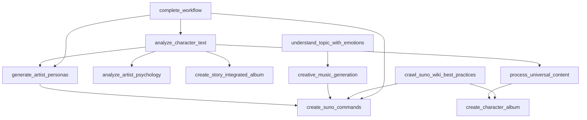

# MCP Tools Integration Guide

## Overview

This guide demonstrates how to integrate the fixed MCP tools into complete workflows for music generation, character analysis, and creative content production. It covers integration patterns, data flow, and best practices for combining multiple tools.

## Integration Architecture

### Tool Dependencies and Flow



### Data Flow Patterns

#### 1. Linear Sequential Flow
Character Text → Character Analysis → Persona Generation → Command Creation

#### 2. Parallel Processing Flow
Character Text → [Character Analysis + Emotional Analysis] → Combined Results

#### 3. Hierarchical Flow
Story Text → Story Album + Character Album + Individual Commands

## Core Integration Patterns

### 1. Basic Music Generation Pipeline

```python
import asyncio
from typing import Dict, Any, List
from mcp_tools_integration import *
from mcp_shared_models import Context, StandardCharacterProfile

class MusicGenerationPipeline:
    """Basic pipeline for music generation from character descriptions"""
    
    def __init__(self):
        self.ctx = Context()
    
    async def generate_music_from_character(
        self, 
        character_description: str,
        genre: str = None,
        include_album: bool = True
    ) -> Dict[str, Any]:
        """Generate complete music package from character description"""
        
        results = {}
        
        # Step 1: Character Analysis
        print("🔍 Analyzing character...")
        char_result = await analyze_character_text(character_description, self.ctx)
        results["character_analysis"] = char_result
        
        if not char_result.get("characters"):
            raise ValueError("No characters found in description")
        
        # Step 2: Generate Artist Personas
        print("🎭 Generating artist personas...")
        persona_result = await generate_artist_personas(char_result, self.ctx)
        results["personas"] = persona_result
        
        # Step 3: Psychological Analysis
        print("🧠 Analyzing artist psychology...")
        main_character = char_result["characters"][0]
        psychology_result = await analyze_artist_psychology(main_character, self.ctx)
        results["psychology"] = psychology_result
        
        # Step 4: Get Best Practices
        print("📚 Retrieving Suno best practices...")
        practices_result = await crawl_suno_wiki_best_practices("all", self.ctx)
        results["best_practices"] = practices_result
        
        # Step 5: Create Suno Commands
        print("🎵 Creating Suno commands...")
        command_result = await create_suno_commands(
            persona_result, char_result, self.ctx
        )
        results["commands"] = command_result
        
        # Step 6: Create Album (if requested)
        if include_album:
            print("💿 Creating character album...")
            
            # Determine genre from persona or use provided
            if not genre and persona_result.get("personas"):
                genre = persona_result["personas"][0].get("genre", "alternative")
            
            album_result = await create_character_album(
                character_description=character_description,
                genre=genre,
                album_theme="Character Journey",
                track_count=6,
                ctx=self.ctx
            )
            results["album"] = album_result
        
        print("✅ Music generation pipeline complete!")
        return results

# Usage example
async def example_basic_pipeline():
    pipeline = MusicGenerationPipeline()
    
    character_desc = """
    Maya Chen is a street violinist who performs in subway stations across 
    New York City. Born in Taiwan and raised in Queens, she blends classical 
    training with urban rhythms, creating a unique sound that captures the 
    heartbeat of the city. Her music tells stories of immigrant dreams and 
    the struggle to find belonging in a new world.
    """
    
    results = await pipeline.generate_music_from_character(
        character_desc, 
        genre="urban classical",
        include_album=True
    )
    
    # Access results
    characters = results["character_analysis"]["characters"]
    personas = results["personas"]["personas"]
    commands = results["commands"]["suno_commands"]
    album = results["album"]["tracks"]
    
    print(f"Generated {len(personas)} personas")
    print(f"Created {len(commands)} Suno commands")
    print(f"Produced {len(album)} album tracks")

asyncio.run(example_basic_pipeline())
```

### 2. Story-Based Music Production

```python
class StoryMusicProducer:
    """Advanced pipeline for story-based music production"""
    
    def __init__(self):
        self.ctx = Context()
    
    async def create_story_music_package(
        self,
        narrative_text: str,
        musical_style: str = "cinematic",
        create_individual_albums: bool = True
    ) -> Dict[str, Any]:
        """Create comprehensive music package from story"""
        
        results = {}
        
        # Step 1: Story-Integrated Album
        print("📖 Creating story-integrated album...")
        story_album = await create_story_integrated_album(
            narrative_text, musical_style, self.ctx
        )
        results["story_album"] = story_album
        
        # Step 2: Character Analysis
        print("🔍 Analyzing story characters...")
        char_analysis = await analyze_character_text(narrative_text, self.ctx)
        results["character_analysis"] = char_analysis
        
        # Step 3: Emotional Analysis
        print("💭 Analyzing story emotions...")
        emotional_analysis = await understand_topic_with_emotions(
            narrative_text, "narrative story", self.ctx
        )
        results["emotional_analysis"] = emotional_analysis
        
        # Step 4: Individual Character Albums
        if create_individual_albums and char_analysis.get("characters"):
            print("🎭 Creating individual character albums...")
            character_albums = []
            
            for char_data in char_analysis["characters"]:
                char_profile = StandardCharacterProfile.from_dict(char_data)
                
                # Create character description for album
                char_description = f"""
                {char_profile.name} is a character from our story. 
                {char_profile.backstory}
                Physical description: {char_profile.physical_description}
                Motivations: {', '.join(char_profile.motivations)}
                """
                
                # Generate album for this character
                char_album = await create_character_album(
                    character_description=char_description,
                    genre=musical_style,
                    album_theme=f"{char_profile.name}'s Journey",
                    track_count=4,
                    ctx=self.ctx
                )
                
                character_albums.append({
                    "character": char_profile.name,
                    "album": char_album
                })
            
            results["character_albums"] = character_albums
        
        # Step 5: Creative Variations
        print("🎨 Generating creative variations...")
        story_themes = story_album.get("story_analysis", {}).get("themes", [])
        if story_themes:
            creative_variations = []
            
            for theme in story_themes[:3]:  # Top 3 themes
                variation = await creative_music_generation(
                    concept=theme,
                    style_preference=musical_style,
                    ctx=self.ctx
                )
                creative_variations.append({
                    "theme": theme,
                    "variations": variation
                })
            
            results["creative_variations"] = creative_variations
        
        # Step 6: Comprehensive Command Set
        print("🎵 Creating comprehensive command set...")
        if results.get("character_analysis") and results.get("story_album"):
            # Generate personas from characters
            persona_result = await generate_artist_personas(
                results["character_analysis"], self.ctx
            )
            
            # Create commands
            command_result = await create_suno_commands(
                persona_result, results["character_analysis"], self.ctx
            )
            
            results["comprehensive_commands"] = command_result
        
        print("✅ Story music package complete!")
        return results

# Usage example
async def example_story_production():
    producer = StoryMusicProducer()
    
    story = """
    In the neon-lit streets of Neo-Tokyo, cyber-detective Akira Tanaka 
    hunts rogue AIs while questioning his own humanity. His partner, 
    the enigmatic hacker known as Ghost, exists only in the digital realm, 
    their consciousness uploaded after a tragic accident.
    
    Together, they navigate a world where the line between human and 
    machine blurs, uncovering a conspiracy that threatens to rewrite 
    the very nature of consciousness itself. Their investigation leads 
    them through virtual nightclubs, abandoned server farms, and the 
    darkest corners of cyberspace.
    """
    
    results = await producer.create_story_music_package(
        story, 
        musical_style="cyberpunk electronic",
        create_individual_albums=True
    )
    
    # Display results summary
    story_album = results["story_album"]
    char_albums = results.get("character_albums", [])
    variations = results.get("creative_variations", [])
    
    print(f"Story album: '{story_album['album_concept']['title']}'")
    print(f"Character albums: {len(char_albums)}")
    print(f"Creative variations: {len(variations)}")

asyncio.run(example_story_production())
```

### 3. Parallel Processing Integration

```python
class ParallelMusicProcessor:
    """Processor that uses parallel execution for efficiency"""
    
    def __init__(self, max_concurrent: int = 5):
        self.ctx = Context()
        self.semaphore = asyncio.Semaphore(max_concurrent)
    
    async def _limited_execution(self, coro):
        """Execute coroutine with concurrency limit"""
        async with self.semaphore:
            return await coro
    
    async def parallel_character_analysis(
        self,
        character_descriptions: List[str]
    ) -> Dict[str, Any]:
        """Analyze multiple characters in parallel"""
        
        print(f"🔄 Processing {len(character_descriptions)} characters in parallel...")
        
        # Create tasks for parallel execution
        analysis_tasks = [
            self._limited_execution(
                analyze_character_text(desc, self.ctx)
            )
            for desc in character_descriptions
        ]
        
        # Execute in parallel
        analysis_results = await asyncio.gather(*analysis_tasks, return_exceptions=True)
        
        # Process results
        successful_analyses = []
        failed_analyses = []
        
        for i, result in enumerate(analysis_results):
            if isinstance(result, Exception):
                failed_analyses.append({
                    "index": i,
                    "description": character_descriptions[i][:100] + "...",
                    "error": str(result)
                })
            else:
                successful_analyses.append({
                    "index": i,
                    "description": character_descriptions[i][:100] + "...",
                    "result": result
                })
        
        return {
            "successful": successful_analyses,
            "failed": failed_analyses,
            "success_rate": len(successful_analyses) / len(character_descriptions)
        }
    
    async def parallel_music_generation(
        self,
        concepts: List[str],
        style: str = "alternative"
    ) -> Dict[str, Any]:
        """Generate music for multiple concepts in parallel"""
        
        print(f"🎵 Generating music for {len(concepts)} concepts in parallel...")
        
        # Create tasks
        generation_tasks = [
            self._limited_execution(
                creative_music_generation(concept, style, self.ctx)
            )
            for concept in concepts
        ]
        
        # Execute in parallel
        generation_results = await asyncio.gather(*generation_tasks, return_exceptions=True)
        
        # Process results
        successful_generations = []
        failed_generations = []
        
        for i, result in enumerate(generation_results):
            if isinstance(result, Exception):
                failed_generations.append({
                    "concept": concepts[i],
                    "error": str(result)
                })
            else:
                successful_generations.append({
                    "concept": concepts[i],
                    "result": result
                })
        
        return {
            "successful": successful_generations,
            "failed": failed_generations,
            "success_rate": len(successful_generations) / len(concepts)
        }

# Usage example
async def example_parallel_processing():
    processor = ParallelMusicProcessor(max_concurrent=3)
    
    # Multiple character descriptions
    characters = [
        "Elena is a flamenco guitarist from Seville who moved to New York.",
        "Marcus is a jazz saxophonist from New Orleans with a troubled past.",
        "Yuki is a J-pop idol who secretly writes death metal songs.",
        "Ahmed is a traditional oud player exploring electronic fusion."
    ]
    
    # Multiple music concepts
    concepts = [
        "The loneliness of city nights",
        "Childhood memories in summer",
        "The weight of unfulfilled dreams",
        "Finding love after heartbreak"
    ]
    
    # Process in parallel
    char_results = await processor.parallel_character_analysis(characters)
    music_results = await processor.parallel_music_generation(concepts, "indie")
    
    print(f"Character analysis success rate: {char_results['success_rate']:.2%}")
    print(f"Music generation success rate: {music_results['success_rate']:.2%}")

asyncio.run(example_parallel_processing())
```

### 4. Error-Resilient Integration

```python
class ResilientMusicWorkflow:
    """Workflow with comprehensive error handling and recovery"""
    
    def __init__(self):
        self.ctx = Context()
        self.fallback_enabled = True
    
    async def robust_workflow(
        self,
        input_text: str,
        target_genre: str = None,
        max_retries: int = 3
    ) -> Dict[str, Any]:
        """Execute workflow with error recovery"""
        
        results = {
            "steps_completed": [],
            "steps_failed": [],
            "partial_results": {},
            "final_status": "unknown"
        }
        
        # Step 1: Character Analysis (Critical)
        try:
            print("🔍 Step 1: Character Analysis")
            char_result = await self._retry_operation(
                analyze_character_text, max_retries, input_text, self.ctx
            )
            results["steps_completed"].append("character_analysis")
            results["partial_results"]["character_analysis"] = char_result
            
        except Exception as e:
            print(f"❌ Character analysis failed: {e}")
            results["steps_failed"].append("character_analysis")
            
            if self.fallback_enabled:
                # Create fallback character data
                char_result = self._create_fallback_character(input_text)
                results["partial_results"]["character_analysis"] = char_result
                print("🔄 Using fallback character data")
            else:
                results["final_status"] = "failed_critical"
                return results
        
        # Step 2: Persona Generation (Important)
        try:
            print("🎭 Step 2: Persona Generation")
            persona_result = await self._retry_operation(
                generate_artist_personas, max_retries, 
                results["partial_results"]["character_analysis"], self.ctx
            )
            results["steps_completed"].append("persona_generation")
            results["partial_results"]["persona_generation"] = persona_result
            
        except Exception as e:
            print(f"⚠️ Persona generation failed: {e}")
            results["steps_failed"].append("persona_generation")
            
            if self.fallback_enabled:
                persona_result = self._create_fallback_persona(target_genre)
                results["partial_results"]["persona_generation"] = persona_result
                print("🔄 Using fallback persona data")
        
        # Step 3: Command Generation (Optional)
        try:
            print("🎵 Step 3: Command Generation")
            if "persona_generation" in results["partial_results"]:
                command_result = await self._retry_operation(
                    create_suno_commands, max_retries,
                    results["partial_results"]["persona_generation"],
                    results["partial_results"]["character_analysis"],
                    self.ctx
                )
                results["steps_completed"].append("command_generation")
                results["partial_results"]["command_generation"] = command_result
            else:
                raise ValueError("No persona data available")
                
        except Exception as e:
            print(f"⚠️ Command generation failed: {e}")
            results["steps_failed"].append("command_generation")
        
        # Step 4: Album Creation (Optional)
        try:
            print("💿 Step 4: Album Creation")
            if results["partial_results"].get("character_analysis"):
                # Extract character description
                characters = results["partial_results"]["character_analysis"]["characters"]
                if characters:
                    char_name = characters[0].get("name", "Unknown Artist")
                    char_desc = f"{char_name} and their musical journey"
                    
                    album_result = await self._retry_operation(
                        create_character_album, max_retries,
                        char_desc, target_genre or "alternative", 
                        "Resilient Journey", 4, self.ctx
                    )
                    results["steps_completed"].append("album_creation")
                    results["partial_results"]["album_creation"] = album_result
            
        except Exception as e:
            print(f"⚠️ Album creation failed: {e}")
            results["steps_failed"].append("album_creation")
        
        # Determine final status
        critical_steps = ["character_analysis"]
        important_steps = ["persona_generation"]
        
        if all(step in results["steps_completed"] for step in critical_steps):
            if all(step in results["steps_completed"] for step in important_steps):
                results["final_status"] = "success"
            else:
                results["final_status"] = "partial_success"
        else:
            results["final_status"] = "failed"
        
        print(f"✅ Workflow completed with status: {results['final_status']}")
        return results
    
    async def _retry_operation(self, func, max_retries: int, *args, **kwargs):
        """Retry operation with exponential backoff"""
        
        for attempt in range(max_retries):
            try:
                return await func(*args, **kwargs)
            except Exception as e:
                if attempt == max_retries - 1:
                    raise e
                
                wait_time = 2 ** attempt  # Exponential backoff
                print(f"🔄 Retry {attempt + 1}/{max_retries} in {wait_time}s...")
                await asyncio.sleep(wait_time)
    
    def _create_fallback_character(self, text: str) -> Dict[str, Any]:
        """Create fallback character data"""
        return {
            "characters": [{
                "name": "Unknown Artist",
                "backstory": "An artist with a unique story to tell",
                "motivations": ["create meaningful music"],
                "fears": ["being forgotten"],
                "desires": ["artistic expression"]
            }],
            "narrative_themes": ["artistic journey"],
            "emotional_arc": {"beginning": "uncertain", "middle": "developing", "end": "hopeful"}
        }
    
    def _create_fallback_persona(self, genre: str = None) -> Dict[str, Any]:
        """Create fallback persona data"""
        return {
            "personas": [{
                "name": "Unknown Artist",
                "genre": genre or "alternative",
                "style_description": "Authentic and heartfelt",
                "vocal_characteristics": ["expressive", "honest"],
                "lyrical_themes": ["personal journey", "authentic expression"]
            }]
        }

# Usage example
async def example_resilient_workflow():
    workflow = ResilientMusicWorkflow()
    
    # Test with potentially problematic input
    test_input = "Some vague text that might not work well"
    
    results = await workflow.robust_workflow(
        test_input,
        target_genre="indie folk",
        max_retries=2
    )
    
    print(f"Final status: {results['final_status']}")
    print(f"Steps completed: {results['steps_completed']}")
    print(f"Steps failed: {results['steps_failed']}")
    
    # Check what results we got
    if results["partial_results"]:
        print("Available results:")
        for step, data in results["partial_results"].items():
            print(f"  {step}: {type(data)}")

asyncio.run(example_resilient_workflow())
```

## Advanced Integration Patterns

### 1. Multi-Modal Content Generation

```python
class MultiModalMusicGenerator:
    """Generate music content across multiple modalities"""
    
    async def generate_complete_package(
        self,
        source_content: str,
        content_type: str = "character"  # "character", "story", "concept"
    ) -> Dict[str, Any]:
        """Generate complete multimedia music package"""
        
        ctx = Context()
        package = {}
        
        if content_type == "character":
            # Character-focused generation
            char_analysis = await analyze_character_text(source_content, ctx)
            personas = await generate_artist_personas(char_analysis, ctx)
            psychology = await analyze_artist_psychology(char_analysis["characters"][0], ctx)
            album = await create_character_album(source_content, "alternative", ctx=ctx)
            
            package = {
                "type": "character_package",
                "character_analysis": char_analysis,
                "personas": personas,
                "psychology": psychology,
                "album": album
            }
            
        elif content_type == "story":
            # Story-focused generation
            story_album = await create_story_integrated_album(source_content, ctx=ctx)
            char_analysis = await analyze_character_text(source_content, ctx)
            emotional_analysis = await understand_topic_with_emotions(source_content, ctx=ctx)
            
            package = {
                "type": "story_package",
                "story_album": story_album,
                "character_analysis": char_analysis,
                "emotional_analysis": emotional_analysis
            }
            
        elif content_type == "concept":
            # Concept-focused generation
            creative_gen = await creative_music_generation(source_content, ctx=ctx)
            emotional_analysis = await understand_topic_with_emotions(source_content, ctx=ctx)
            
            package = {
                "type": "concept_package",
                "creative_generation": creative_gen,
                "emotional_analysis": emotional_analysis
            }
        
        # Add universal elements
        best_practices = await crawl_suno_wiki_best_practices(ctx=ctx)
        package["best_practices"] = best_practices
        
        return package
```

### 2. Quality Assurance Integration

```python
class QualityAssuredWorkflow:
    """Workflow with built-in quality checks"""
    
    def __init__(self):
        self.quality_thresholds = {
            "character_confidence": 0.7,
            "persona_completeness": 0.8,
            "command_validity": 0.9
        }
    
    async def execute_with_qa(self, input_text: str) -> Dict[str, Any]:
        """Execute workflow with quality assurance"""
        
        ctx = Context()
        results = {"quality_checks": {}}
        
        # Character analysis with QA
        char_result = await analyze_character_text(input_text, ctx)
        char_quality = self._assess_character_quality(char_result)
        results["quality_checks"]["character_analysis"] = char_quality
        
        if char_quality["score"] >= self.quality_thresholds["character_confidence"]:
            results["character_analysis"] = char_result
            
            # Persona generation with QA
            persona_result = await generate_artist_personas(char_result, ctx)
            persona_quality = self._assess_persona_quality(persona_result)
            results["quality_checks"]["persona_generation"] = persona_quality
            
            if persona_quality["score"] >= self.quality_thresholds["persona_completeness"]:
                results["persona_generation"] = persona_result
                
                # Command generation with QA
                command_result = await create_suno_commands(persona_result, char_result, ctx)
                command_quality = self._assess_command_quality(command_result)
                results["quality_checks"]["command_generation"] = command_quality
                
                if command_quality["score"] >= self.quality_thresholds["command_validity"]:
                    results["command_generation"] = command_result
        
        return results
    
    def _assess_character_quality(self, result: Dict) -> Dict[str, Any]:
        """Assess character analysis quality"""
        characters = result.get("characters", [])
        if not characters:
            return {"score": 0.0, "issues": ["No characters found"]}
        
        char = characters[0]
        score = 0.0
        issues = []
        
        # Check required fields
        if char.get("name"):
            score += 0.3
        else:
            issues.append("Missing character name")
        
        if char.get("backstory"):
            score += 0.3
        else:
            issues.append("Missing backstory")
        
        if char.get("motivations"):
            score += 0.2
        else:
            issues.append("Missing motivations")
        
        if char.get("fears") or char.get("desires"):
            score += 0.2
        else:
            issues.append("Missing emotional depth")
        
        return {"score": score, "issues": issues}
    
    def _assess_persona_quality(self, result: Dict) -> Dict[str, Any]:
        """Assess persona generation quality"""
        personas = result.get("personas", [])
        if not personas:
            return {"score": 0.0, "issues": ["No personas generated"]}
        
        persona = personas[0]
        score = 0.0
        issues = []
        
        required_fields = ["name", "genre", "style_description", "vocal_characteristics"]
        for field in required_fields:
            if persona.get(field):
                score += 0.25
            else:
                issues.append(f"Missing {field}")
        
        return {"score": score, "issues": issues}
    
    def _assess_command_quality(self, result: Dict) -> Dict[str, Any]:
        """Assess command generation quality"""
        commands = result.get("suno_commands", [])
        if not commands:
            return {"score": 0.0, "issues": ["No commands generated"]}
        
        score = 0.0
        issues = []
        
        for i, cmd in enumerate(commands):
            if "[" in cmd and "]" in cmd:
                score += 0.3
            else:
                issues.append(f"Command {i+1} missing meta tags")
            
            if len(cmd) > 20:
                score += 0.2
            else:
                issues.append(f"Command {i+1} too short")
        
        # Normalize score
        if commands:
            score = min(score / len(commands), 1.0)
        
        return {"score": score, "issues": issues}
```

## Best Practices for Integration

### 1. Error Handling Strategy

```python
# Always use try-catch for individual tools
try:
    result = await tool_function(input_data, ctx)
except Exception as e:
    logger.error(f"Tool failed: {e}")
    # Handle gracefully or use fallback
```

### 2. Data Validation

```python
def validate_tool_output(result: Dict, expected_keys: List[str]) -> bool:
    """Validate tool output has expected structure"""
    return all(key in result for key in expected_keys)
```

### 3. Performance Monitoring

```python
import time

async def monitored_tool_call(tool_func, *args, **kwargs):
    """Monitor tool performance"""
    start_time = time.time()
    result = await tool_func(*args, **kwargs)
    execution_time = time.time() - start_time
    
    if execution_time > 30:  # Log slow operations
        logger.warning(f"Slow tool execution: {execution_time:.2f}s")
    
    return result
```

### 4. Resource Management

```python
# Use semaphores for concurrent operations
semaphore = asyncio.Semaphore(5)  # Max 5 concurrent operations

async def limited_tool_call(tool_func, *args, **kwargs):
    async with semaphore:
        return await tool_func(*args, **kwargs)
```

This integration guide provides comprehensive patterns for combining MCP tools into powerful workflows. Use these patterns as starting points for building your own custom music generation and character analysis systems.